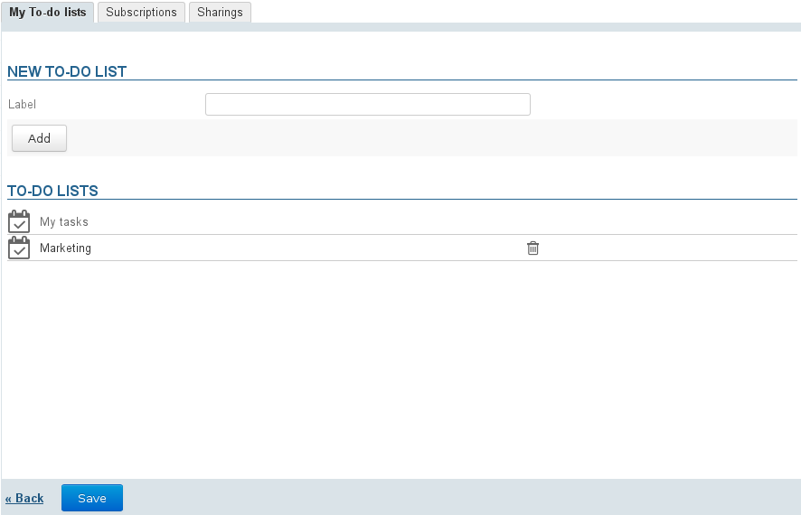
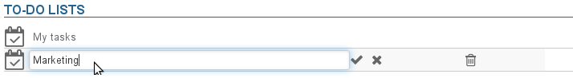
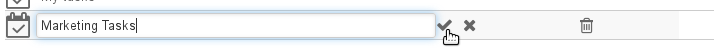
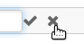
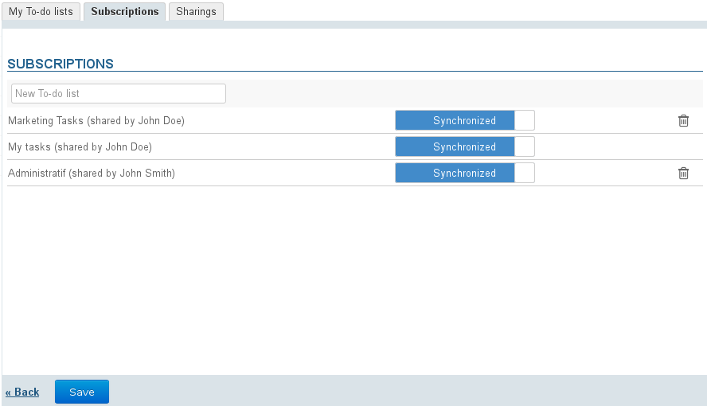
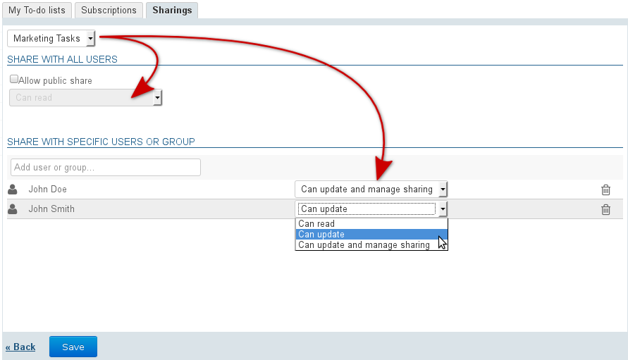

# Task Preferences

# Introduction

To access task preferences, go to "My Account" by clicking your username to the right of the navigation bar:

# To-do lists

The first tab allows you to manage your to-do lists, in addition to what you can do within the application itself:

By default, each user has a personal list named "My To-do List", which cannot be edited or deleted.

## Creating a to-do List

To create a to-do list:

- Enter a name
- Click the "Add" button

The list is shown below and is immediately available in the application.

## Editing to-do lists

To rename a list, click its name to open the text box:

Enter the new name and click the check mark at the end of the row to confirm, or type Enter or simply leave the box:

:::important

Until you have confirmed your changes, you can click the "x" at the end of the row to cancel them: 

:::

## Deleting to-do lists

To delete a to-do list, click the  trash icon at the end of the corresponding row:

:::important

The tasks contained in the list will be deleted with the list.

:::

# Subscribing to a to-do list

This tab allows you to subscribe to to-do lists or to access your lists to enable their synchronization for offline or third-party client (thick client software or mobile device):

 **  ** 

When synchronization is enabled for a list, the data is downloaded into the software client. As a result:

    |  | Synchronization Enabled | Synchronization Disabled |
| --- | --- | --- |
| Web Application and Thunderbird | Tasks can be viewed and are available offline | Tasks can be viewed online but unavailable offline |
| EAS iOS | Tasks can be viewed and are available offline through the *Reminders* app | Tasks cannot be viewed |
| EAS (other) | If your device allows it (refer to the [Compatibility](https://forge.bluemind.net/confluence/display/DA/.Compatibilite+vBM-3.5) page for more details):- tasks can be viewed- tasks are available offline | Tasks cannot be viewed |
| DAV | Tasks can be viewed and are available offline |
| Outlook | - Tasks can be viewed and are available offline - If a subscription is added in Outlook, it is automatically added in BlueMind | Tasks cannot be viewed |

:::important

When a list contains a large amount of data (more than 9,000 tasks), you will receive a warning message about possible synchronization issues.

:::

To add a list:

- Type the name of the list you are looking for (user, resource, ...).
- Press &lt;Enter> to confirm or choose from the list of autocomplete suggestions.
- Disable synchronization if desired.
- **Click "Save" to apply changes.**

To delete a list:

- Click    at the end of the row.
- **Click "Save" to apply changes.**

:::important

You must click "Save" for the change in synchronization status to be applied then **run synchronization again (or wait for automatic synchronization)** on the client software for changes to be applied (data download and viewing if enabling, data deletion if disabling).

:::

# Managing Sharing

BlueMind allows you to share to-do lists with others to make them available for viewing or to create shared lists with read and write rights.

Possible sharing rights are:

- **Read rights**: users are able to view tasks only, by displaying the list in their calendar view or in their Tasks application.
- **Read and write rights**: in addition being able to view tasks, users can edit, create or delete tasks from the list.
- **Read and write and sharing management rights**: in addition to the rights above, users can manage task sharing from their preferences.

To share a list:

1 Choose the list from the drop-down list at the top of the tab.Users can share: 
  - their personal lists: "My To-do lists" or other lists created
  - the lists they have a delegation on: they have been given the right "Can updated and manage sharing"
1 If you want to make a list public, check the box "Allow public share" and select the rights level you want to give users.
1 ** **Recommended choice** ** ** **:** **If you prefer to assign rights individually to certain users or a group, look for their name in the text box and select the right you want to give them.
1 Once all rights are set as desired, click ** "Save" **to confirm

