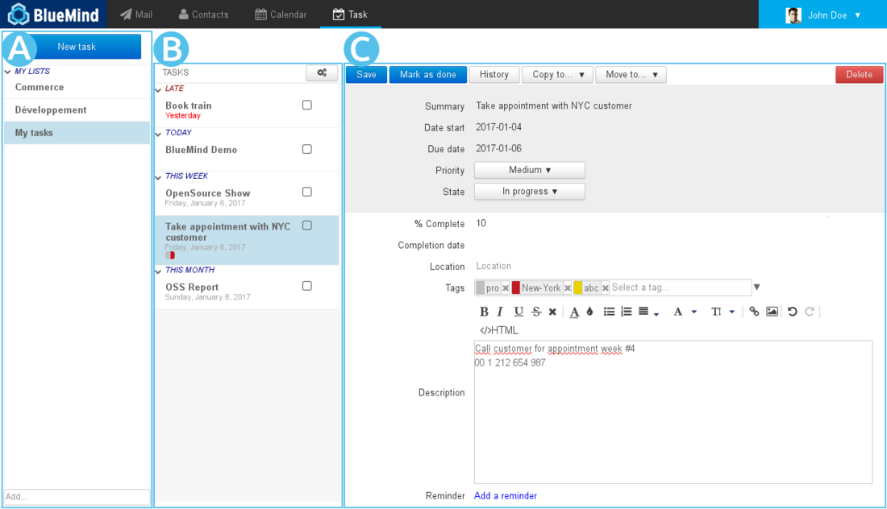
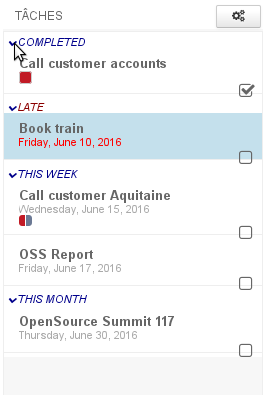
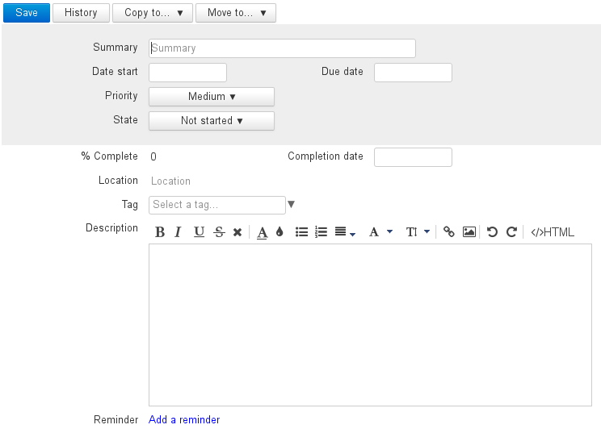
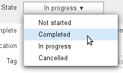
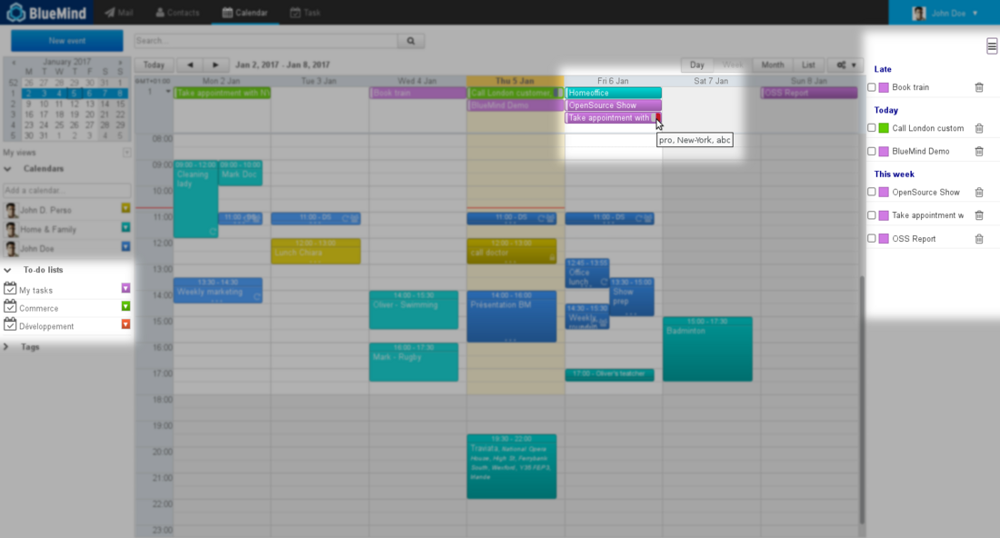
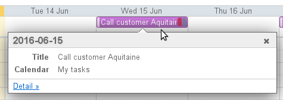
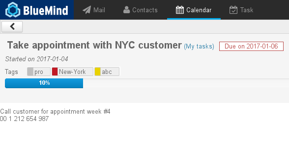
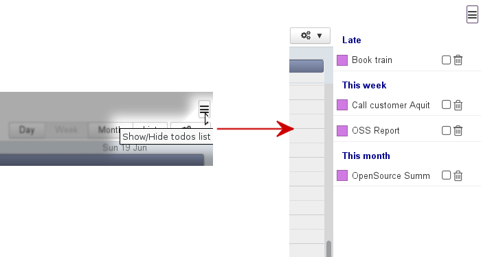

# Tasks

## Introduction

BlueMind features a task manager which synchronizes with the calendar and has its own dedicated UI.

Organize your tasks in lists and use tags which are shared across other BlueMind applications (contacts and calendar).

Share your task lists with your workmates by delegating them simple viewing or full management rights.

## The Tasks UI

The Task application display has three columns:

-  : This first column, under the "New task" button, shows the lists of tasks you are subscribed to: your default list "My tasks", as well as other lists you've created or you've subscribed to (via settings)
-  : The second column shows the tasks contained in the list selected. The action button at the top of the column allows you to export and import tasks from or into this list
-  : The third column, the main display area, shows the details of the task which is being created or selected.

## Task lists

By default, you have one list named "My tasks" and you can create as many additional lists as you like. You can also subscribe to lists other users share with you via settings.

To add a new list, enter your name in the "Add..." box at the bottom of  and press &lt;Enter> to confirm:

A list's tasks are arranged according to their status in drop-down sub-lists:

- COMPLETED: list of completed tasks
- LATE: highlights the uncompleted tasks whose due date has passed
- THIS WEEK: tasks whose due date is in the current week
- THIS MONTH: tasks whose due date is in the current month, excluding the current week

## Tasks

### Creating tasks

The  button opens the create task form. The new task is added to the current list:

- **Summary: task name or short description **
- Date start: date on which the task is to start
- Due date: planned due date
- Priority: low, average (default), high
- State: current completion status: not started, completed, in progress, cancelled
- % Complete: allows you to keep track of a task's progress by entering a completion percentage
- Completion date: effective completion date
- Location
- Tag: Tags are shared with the contacts and calendar applications. Your own tags as well as the domain's tasks are available
- Description: more extensive task description, useful or additional information
- Reminder: sets a reminder for the task's start date

Once you've filled in and saved the form, the task is shown in the list and the  button appears at the top of the form.

### Modifying tasks

To edit a task:

- Click it in the list
- Make the changes in the form
- Click  at the top left of the editing form to validate

To copy or move a task to another list:

- Click  or 
- Choose the list from the drop-down menu
- Click  at the top left of the editing form to validate

### Completing a task

BlueMind gives you several ways to mark a task as completed:

- Click the  button in the task editing form
- Use the "State" drop-down list in the task editing form: 
- Check the box in the [Calendar tasks pane](#Lestaches-actions-taches)

:::tip

In the task editing form, the "Completion date" box allows you to enter the task's effective completion date.

:::

### Deleting a task

To delete a task:

- Click the button at the top right of the editing form

:::info

Warning

 No delete confirmation dialog will be displayed, the task will be deleted directly and permanently.

:::

## Integration with the calendar

In the Calendar, tasks are shown as calendars. Lists are grouped in a "Todolists" sub-menu on the left and tasks are shown at the top, as all-day events, on their due date. Additionally, you can choose to display a task pane to the right of the page which shows the list of tasks and gives you access to key task features:

### Viewing a task

Clicking the event you want to view opens a summary task pop-up:

Click "Detail" for more information:

:::tip

The % icon before the title shows the task's priority status: gray for "low", green for "normal", red for high.

:::

### Task actions

In the top right corner of the Calendar, the  button shows/hides the task pane:

Tasks in progress are arranged in the same way as in the Tasks application:

- Late: tasks whose due date has expired
- Today: tasks whose due date is today
- This week: tasks whose due date is in the current week
- This month: tasks whose due date is in the current month, excluding the current week

Each task is shown with:

- the color-code of the list it belongs to
- its title
- a check box which allows you to mark the task as done. It then disappears automatically from the calendar view and the list
- a trash icon  which allows you to delete the task

:::info

Deletion is immediate and cannot be undone. You will not be asked to confirm.

:::

