# BlueMind Mail

## Introduction

BlueMind has developed a brand new webmail application based on the latest browser technology – Web App Javascript. This has allowed us to build a fully redesigned and intuitive interface with 3 panes adapted to large screens. Most importantly, it helps make the application faster and smoother by using local browser storage.

This application, still in its Beta version, doesn't cover our former webmail's entire perimeter yet, but it works! You can seamlessly switch back to our standard webmail version and keep all your data. This new application's components will be expanded gradually to offer the same features as our old webmail version. 

We therefore encourage you to test it right now, although we do recommend that you be very careful as this being a beta version you may encounter some issues. 

We look forward to hearing your feedback!

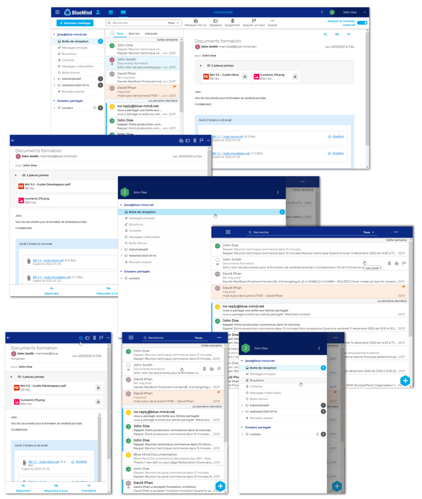

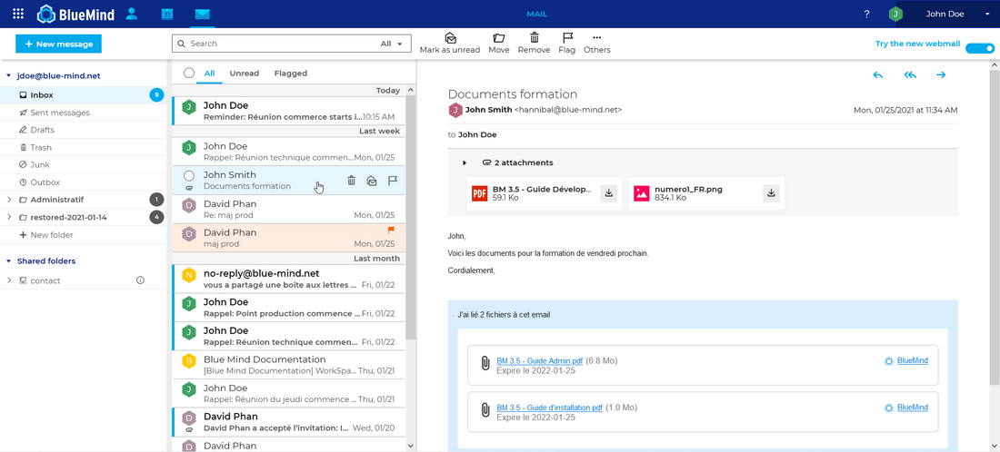

## How to try the new webmail

BlueMind's new webmail has to be [installed and provisioned to users by the administrator](/Guide_d_installation/Installation_du_nouveau_client_de_messagerie/).

Once this is done, a toggle button in the top right hand corner of the application lets you switch between classic BlueMind webmail and the new webmail:

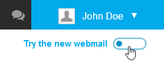

You can also switch between versions in your Mail preferences settings:

## Display

### Navigation ribbon

The navigation ribbon at the top of the window has been updated and redesigned to our new interface's standards. It is used to:

- switch between applications (left-hand section):
- access preferences and log out (right-hand section):
-  access BlueMind online documentation by clicking the question mark in the right-hand section: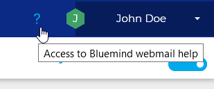

### The Webmail application

The webmail application has a three-column view:

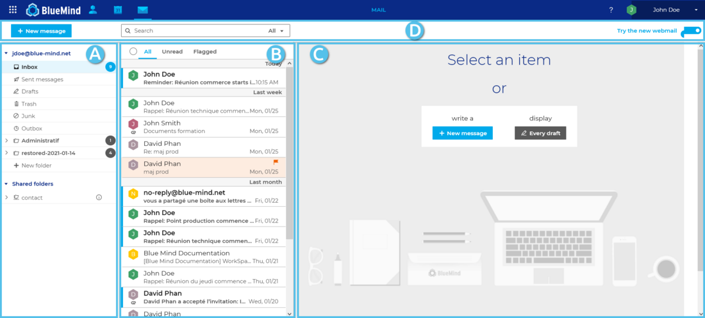

1. **Left-hand side column**: folder listThe folder column shows the list of folders which can be grouped into user and shared mailboxes and expanded or collapsed.
2. **Center-column**: list of messages in the folder selected in column A.Filters at the top of the list are used to display a certain type of messages only. Hovering over a message displays information and possible actions.
3. **Right-hand column**: main display areaThe home screen shows possible actions and the message selected is shown when appropriate.
4. **Action bar**: includes the "new message" button, the search engine and actions available depending on the current display (message actions when a message is displayed or group actions when several messages are selected).

## Folder list

### Introduction

The left-hand side column shows the list of folders you have access to – as read-only or read-write – arranged into two collapsible lists:

1. **The user account **shows your own folders: default folders (inbox, sent messages, trash, etc.) followed by the folders you have created, sorted alphabetically
2. **Shared folders**: shows the shared mailboxes you have read and/or write permission on.

:::info

User mailboxes

In the current version of the webmail application, user mailboxes are not shown yet. This will be made effective in the final version.

:::

When a folder is selected:

- the messages it contains are shown in the center column
- the name of the folder is shown on a blue background
- the chip showing the number of unread messages in the folder is bright blue:

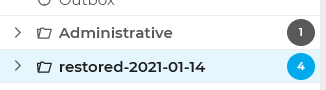
 *The "restored-2021-01-14" folder is selected*

When you hover over a folder, a menu opens showing the actions available for this folder and for the messages it contains:

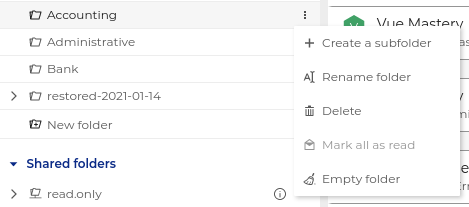Actions currently available are:

- **Create a subfolder **(see details below)
- **Rename folder **(see details below)
- **Delete**

:::info
Folders and its contents deleted here are permanently deleted: the messages contained in this folder are not placed in the trash folder.
:::

- **Mark all as read**: all the messages in the folder are marked as read

:::tip

An "Empty folder" action will be available in BlueMind version 4.5. It will be available for all folders – not just the Trash folder.

:::

### Managing folders

Folders are managed in the folder list.

#### Creating a folder

- At the bottom of your folder list you will find a "New folder" button: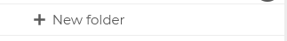
- Click it to open the text box: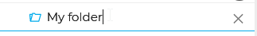
    - Press &lt;Enter> to confirm
    - Press &lt;Esc> or click the "x" at the end of the row to cancel

#### Creating a sub-folder

- Place your cursor on the parent folder you want to create a folder in
- Expand the menu (see above)
- Click "Create subfolder", a new folder is shown under the selected folder with a text box to enter a name in: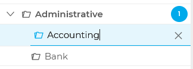
    - Press &lt;Enter> to confirm
    - Press &lt;Esc> or click the "x" at the end of the row to cancel

#### Renaming a folder

- Place your cursor on the parent folder you want to modify
- Expand the menu (see above)
- Click "Rename folder" to enable editing: 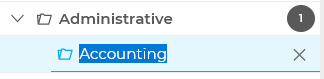
    - Press &lt;Enter> to confirm
    - Press &lt;Esc> or click the "x" at the end of the row to cancel

#### Deleting a folder

- Place your cursor on the parent folder you want to delete
- Expand the menu (see above)
- Click "Delete"
- You are prompted to confirm
- If you confirm the folder and the messages it contains is deleted.

:::info

Folders and its contents deleted here are permanently deleted: the messages contained in this folder are not placed in the trash can.

:::

#### Moving a folder

This feature isn't available in this beta version of the webmail application.

To work around this, you can move the messages the folder contains:

- Create a destination folder where desired
- Go to the source folder
- Select all the messages ("All" button at the top of the list)
- Move the messages by sliding them into the new folder (see below).

## Message list

### Introduction

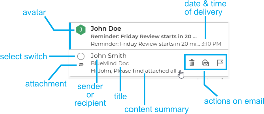

:::tip

The messages list is currently sorted by date only – we are working on updating this.

:::

Unread messages are shown with a blue vertical stripe at the beginning of the row and in bold type:

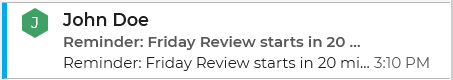

At the top of the list, you have 3 options to change what messages are displayed:

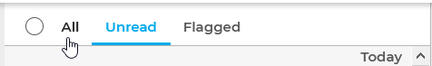

- **All**
- **Unread**
- **Flagged**: shows messages flagged as important only

The radio button in front of the filters lets you select all the messages currently displayed.

To customize the display for the message list, please refer to the page

### Actions on messages

#### Quick actions

Key actions are available when you hover over a message in the list:

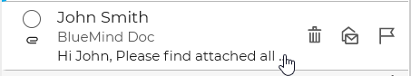

Messages can be:

- selected
- deleted
- marked as read/unread
- flagged/unflagged

#### Selecting messages

##### Selecting one or several messages

When you hover over a message, a radio button appears, which you can use to select the message. Click the buttons of as many messages as you want to select:

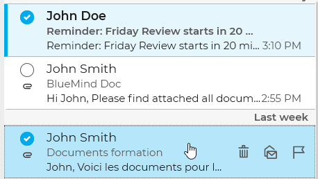

##### Selecting all messages

The radio button button at the top of the list is used to select/unselect all the messages in the folder, depending on the filter that is enabled:

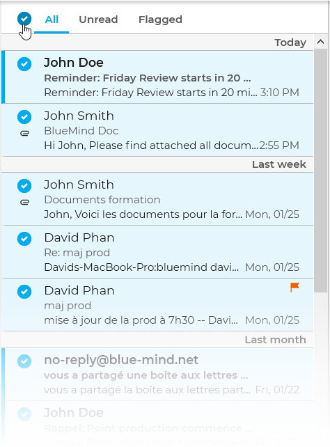

#### Grouped actions on messages

When one or several messages are selected, possible actions are enabled in the action bar and in the main display area:

Grouped actions available are:

- **Mark as read**
- **Move**: opens a menu that lets you search for a destination folder: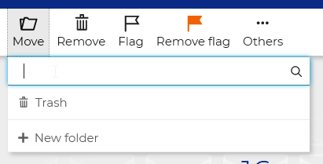
- **Delete**
- **Flag**: flags the messages as "important" (shown only if unflagged messages are selected)
- **Remove flag**: removes the flag from the messages (shown only if flagged messages are selected)
- **Other**: this menu includes the action "Remove permanently". When confirmed, all the messages will be deleted without being moved to the trash folder

#### Moving messages

Messages can be moved by dragging and dropping them either one by one or by selecting multiple messages (see above):

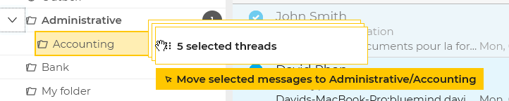

A confirmation message shows that the operation was successful. Click the folder name in the message for the messages to be redirected directly to the destination folder
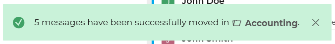

## Displaying a message

The main display window shows the selected message:

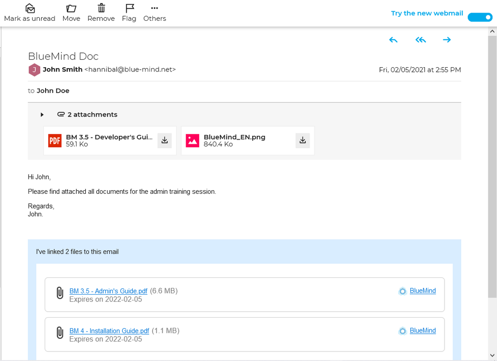

The action bar above the message shows you the actions available for that message:

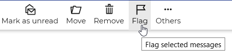

Reply and forwarding buttons are available in the top right corner of the message:

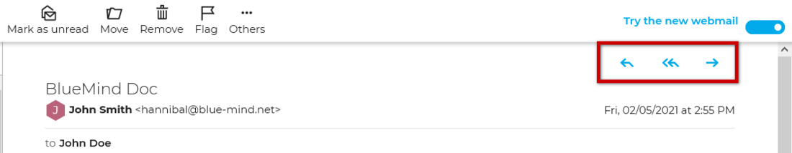

### Attachments

A collapsible pane below the header shows message attachments, with a preview when available. Each file can be downloaded using the 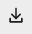 button.

Depending on the type of attachment, clicking this will either open the preview pane or will prompt you to download or open the file.

:::tip

A "download all files" option will be available in an upcoming version as well as [linked attachments](https://forge.bluemind.net/confluence/display/BM4/Fichiers+volumineux+et+detachement+des+pieces+jointes).

:::

