# User Settings

# Introduction

The user settings manager allows you to customize your BlueMind environment.

To access user settings, go to "My account" in the navigation toolbar at the top of all BlueMind pages:

# My account

The General tab in "Account" allows you to specify general localization and display settings:

- Display language.  
- Time zone. The application's clock is set automatically. 
- Date format: day/month/year or month/day/year or year-month-day.
- Time format: 24-hour ("13:00") or AM/PM ("1:00 pm").
- The application that opens by default when you connect to BlueMind.
- Change password.

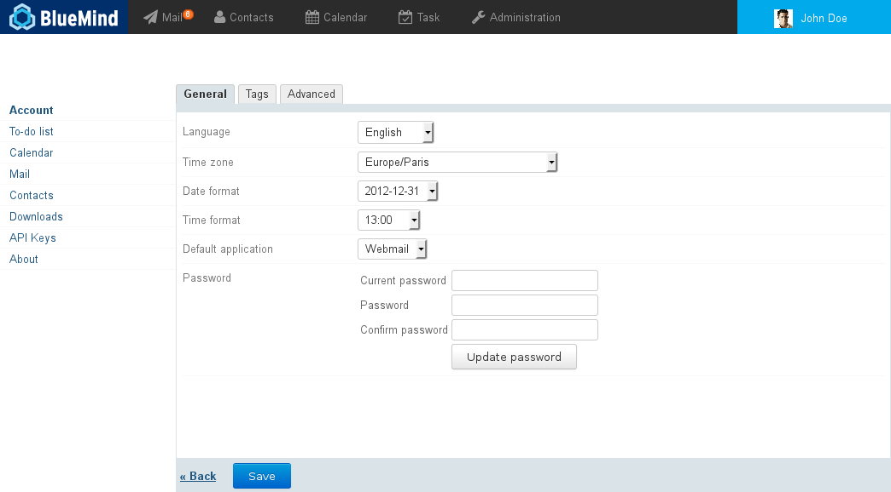
:::important

About languages

BlueMind is currently available or being translated in several languages. You can see the languages available and their progress on the application's translations page: [https://forge.blue-mind.net/translate/](https://forge.blue-mind.net/translate/)

:::

# Password expiry

From BlueMind version 4.3, administrators can set up a password expiry policy:

- systematically: all user passwords must be changed after a set number of days
- on an ad hoc basis: when an account has been compromised, administrators can force-expire your password and you will have to change it.

In either case, when you attempt to log in with the old password, the window below will open:

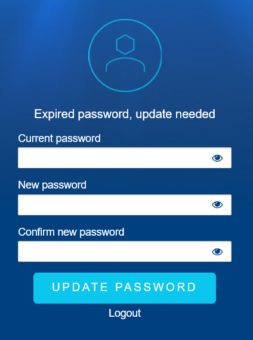Once the password has been changed, you will be redirected to the log in window again you will be able to log into BlueMind with your new password.

# Resetting data

The "Advanced" tab in "Account" gives you access to advanced settings. Specifically it allows you to reset the application's data and enable notifications (see below).

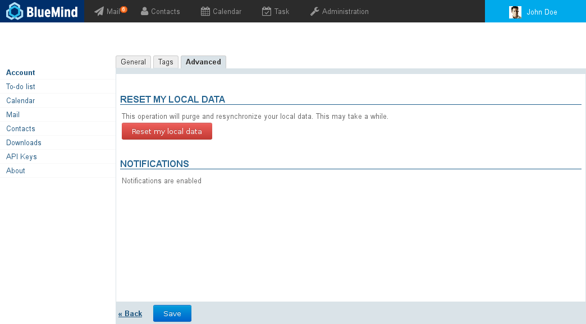

# Notifications 

BlueMind allows you to receive on-screen new message notifications and event reminders.

The following browsers support this feature:

- Chrome
- Firefox
- Safari

The following browsers do not support this feature:

- Internet Explorer
- Opera

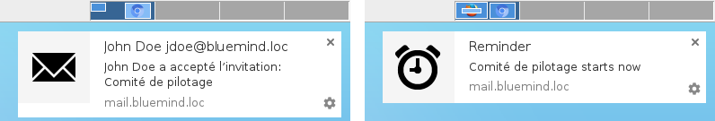

Event reminder and new message notification with Chrome on OS X

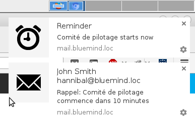

Two simultaneous notifications with Chrome on OS X

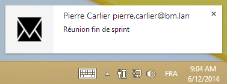

New message notification with Chrome on Windows

Clicking an email notification opens the message in Mail. Clicking on an event reminder opens Calendar. 

Notifications go away on their own after a few seconds. To force-close them without opening BlueMind, click the "x" in the top right corner of the notification box.

## Enabling notifications

- Go to the "Advanced" tab.
- Click "Enable notifications":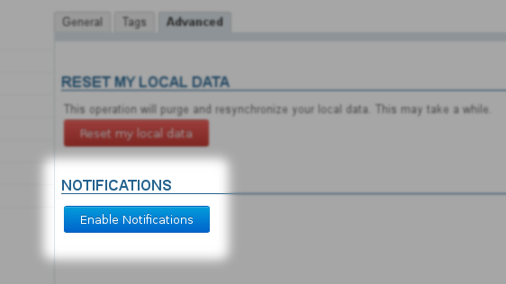
- Confirm that you want to enable notifications in your browser. In Firefox, for example, select "Always Show Notifications" in the drop-down menu: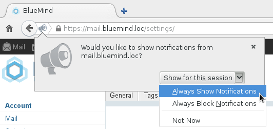

## Disabling notifications

If you no longer want to receive BlueMind notifications, the steps to follow differ depending on your browser.

### Firefox

- Go to the Tools menu > Page Info > Permissions tab.
- 
Look for "Show Notifications" and enable "Always Ask":
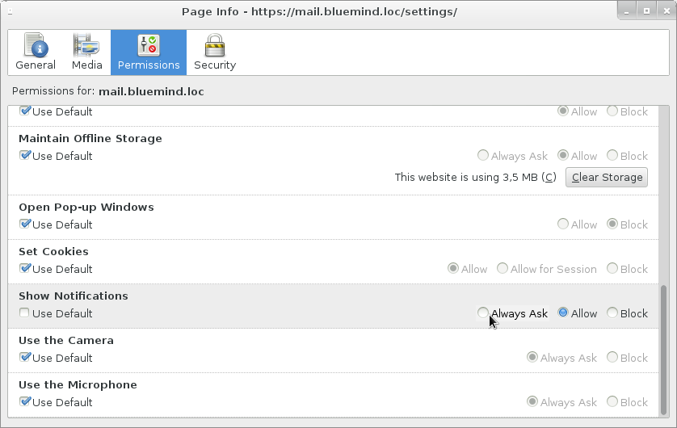
:::important

Choosing "Block" will stop any future attempt to enable BlueMind notifications. When you go to the page to enable notifications, the button will be visible but inactive.

:::

# Downloads

The downloads section in settings allows you to download the connector to synchronize BlueMind with your [Thunderbird](/Guide_de_l_utilisateur/Configuration_des_clients_lourds/Configuration_de_Thunderbird/).

# API keys

This section allows you to generate access keys to the BlueMind API in order to identify your development "projects".

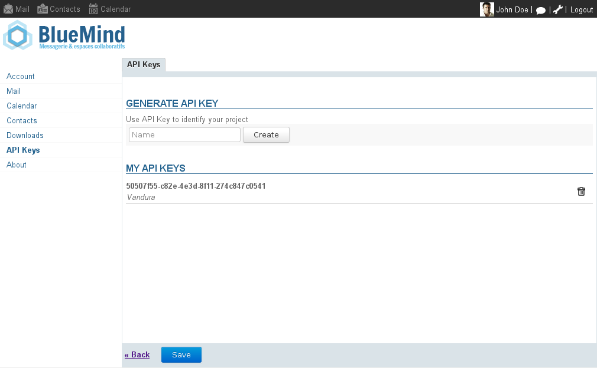

## Generating an API key

To generate an API key for a project:

1 Type the project name in the "Name" text box.
1 Click "Create". the key is generated and created automatically, and immediately added to the list of API keys with the project name you have given it. It can be copied and used right away. 

## Deleting an API key

To revoke an API key:

1 Click  at the end of the key's row.
1 Confirm deletion.

:::important

Deletions are effective immediately, without clicking "Save" at the bottom of the page. As soon as you confirm deletion in the warning dialog box, the key is deleted.

:::

# About BlueMind

This section shows BlueMind's installed version details and relevant subscription information:

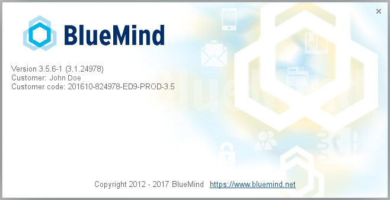

