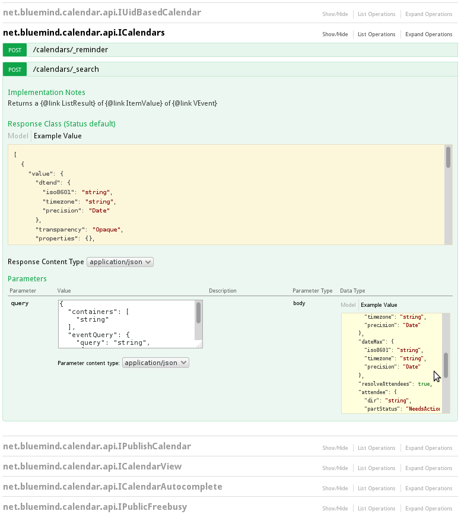

# API BlueMind

## Introduction

The BlueMind API has been completely redesigned and is available either directly via HTTP REST calls or using clients (now Java, Javascript, C#, Python, PHP and .NET). The bluemind-samples repository is available and gathers all that is needed to contribute to BlueMind by developing an Add-On. A maven archetype is also available to facilitate the definition of a new project.

An interactive documentation of our new REST API is embedded in the installer: it is the optional bm-docs package. Once installed, the REST API documentation will be available to users with the "Api docs" right. This documentation is also published in the [BlueMind Docs space](https://forge.bluemind.net/apidoc/).

  

 

## API clients

### Java generated client

See the dedicated page: [Client Java](/Guide_du_développeur/API_BlueMind/Client_Java/)

### python client

See the dedicated page: [Client Python](/Guide_du_développeur/API_BlueMind/Client_Python/)

### PHP client

See the dedicated page: [Client PHP](/Guide_du_développeur/API_BlueMind/Client_PHP/)

### .Net client

The client can be downloaded at this address: [https://pkg.bluemind.net/pkg/4.1.55012/clients/](https://pkg.bluemind.net/pkg/4.1.55012/clients/)

## Examples of use

For more information and examples of use, see the following pages:

- [Authentification](/Guide_du_développeur/API_BlueMind/Authentification/)
- [API utilisateur](/Guide_du_développeur/API_BlueMind/API_d_utilisateurs/)

Enregistrer

Enregistrer

