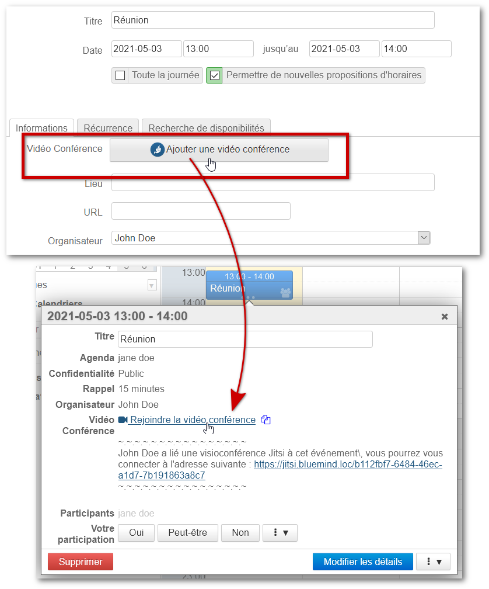
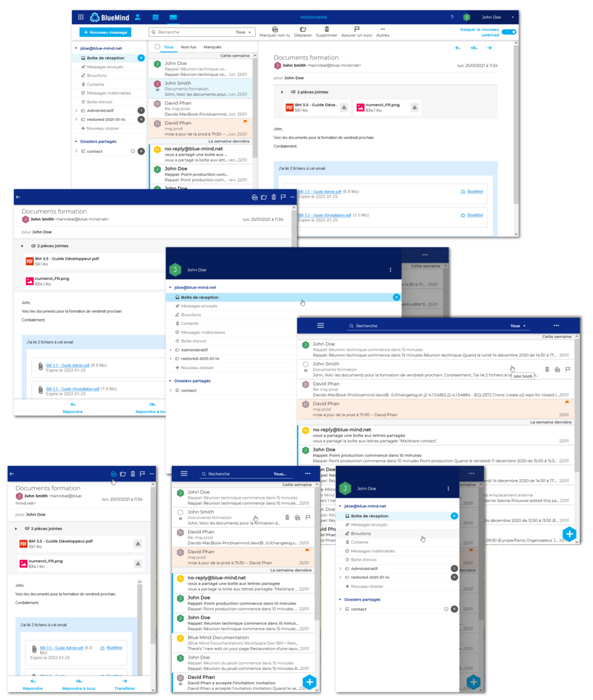
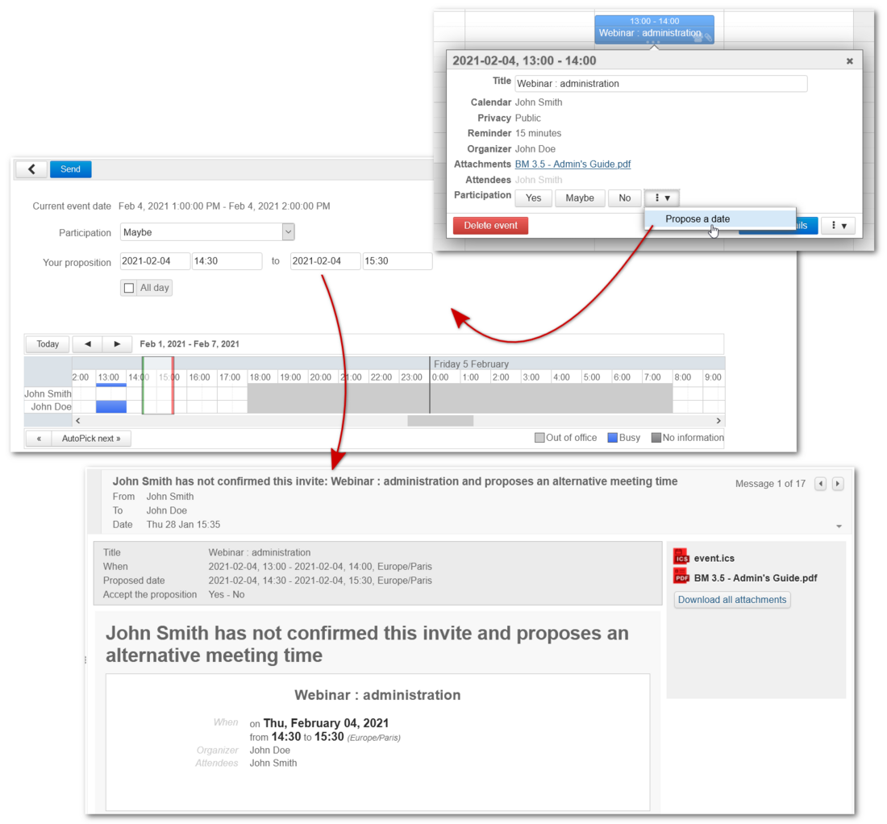
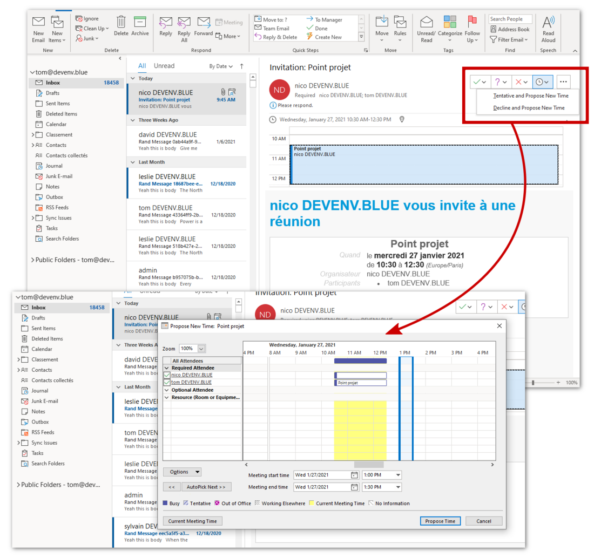
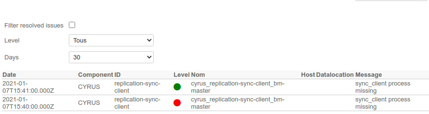

# New in BlueMind 4.4 and 4.5


## Foreword

The whole BlueMind team is happy to introduce its brand new version of its collaborative email suite!

An vast array of performance improvements have been added to this version 4.4, in addition to a wealth of new features for both users and administrators.

[BlueMind's eagerly awaited new webmail ](/Guide_de_l_utilisateur/Messagerie_BlueMind/)is now available for testing! Check out its new responsive interface that adapts to all screens and browsers.

New user features include:

- proposing a new timeslot in response to a meeting invitation
- restoring deleted messages (from Outlook or by asking an administrator)
- HTML out-of-the-office messages (in Outlook)


As for administrators, they have more options to fine-tune their installation and have new tools at their disposal:

- default time zone 
- domain name editing and customization
- HTTP proxy definition
- command line tool upgrades
- shared mailbox repair
- new monitoring dashboards
- monitoring alert notifications in the admin console


For more details on this version's technical upgrades and corrections, please refer to [our version notes](https://download.bluemind.net/bm-download/4.4.0/changelog.html).


:::tip

Download BlueMind 4 here: [https://download.bluemind.net/bm-download](https://download.bluemind.net/bm-download).

For specific updates, please read our version notes for more details about the corrections made.

:::

## New in BlueMind 4.5

### Video-conferences with Jitsi and StarLeaf

BlueMind 4.5 brings the possibility to link a Jitsi or StarLeaf server to a domain so that users can generate and link video-conferences to their calendar events:

To find out more about implementing this feature, please refer to our Administration Guide page: [Integrated Videoconferencing](/Guide_de_l_administrateur/Configuration/Visioconference_integree/).

To find out more about using it in the Calendar, please go to our User's Guide page: [Linking a Video-Conference to an Event](/Guide_de_l_utilisateur/L_agenda/Lier_une_visioconférence_à_un_événement/).

### Read/unread status for shared mailboxes

For improved clarity and not to disrupt the habits of users who are familiar with other mail systems, the read/unread indicators for shared mailboxes are now the same for all the users of a shared mailbox. 

This behavior can no longer be configured by administrators.

### Shared inboxes in Outlook

Shared inboxes are now shown as shared mailboxes in Outlook's main folder list and no longer in the "Public Folders" section:


### Administration

#### Hot updates

To make the work of BlueMind administrators and integrators easier, maintenance – such as repairing some users – can now be performed automatically through hot updates. As a result, maintenance operations do not interfere update processes or production resumption.

#### Seamless maintenance operations

Database maintenance and production processes now run in parallel so that production isn't interrupted. Maintenance is now fully controlled by a planned task, which can be seen and disabled by the administrator and no longer causes disruptions for users.

#### No user-log out during BlueMind restarts

Users are no longer logged out when BlueMind is restarted. System disruptions during a hot fix or update are minimized for end-users who no longer lose work in progress (e.g. an email being written).

## New in BlueMind 4.4

### New Mail client

Discover [BlueMind's new webmail](/Guide_de_l_utilisateur/Messagerie_BlueMind/)!

BlueMind has developed a brand new webmail based on the most recent browser technology – Web App Javascript which offers a redesigned, intuitive interface and three panes adapted to large screens. Most significantly, it is faster and smoother thanks to local browser storage.

Please try it now, we'd love to hear your feedback!



### Proposing new dates

Being able to make a counter proposal to a meeting time/date is finally possible! It is compatible with calendars that support this feature through BlueMind's webmail and with Outlook over MAPI and Thunderbird!



The meeting's organizer stays in control of whether to let invitees suggest a new time.

For more details on how to use this feature, please refer to our documentation's section on calendar events: [User's Guide](/Guide_de_l_utilisateur/) > [Calendar](/Guide_de_l_utilisateur/L_agenda/) > [Events](/Guide_de_l_utilisateur/L_agenda/Les_événements/) [§.5.3 Propose a new time](/Guide_de_l_utilisateur/L_agenda/Les_événements/#Lesevenements-newtime)

In Outlook, invitees and the organizer can use the usual event-response tools to send/accept/decline a proposal:



### Double-bottom trash

The double-bottom trash folder lets users recover deleted items. It includes a server-side delay during which deleted emails are kept – during that time, users can retrieve messages from their Outlook client (over MAPI) or the administrator can retrieve them from the server in command line (see below).

This feature will be implemented in the new BlueMind webmail application in an upcoming version.

### MAPI

In addition to bug fixes, this new version comes with new features now available in Outlook over MAPI.

#### Rich text out-of-the-office message

Out-of-the-office autoreplies configured in Outlook can now be written in HTML format. Users can now choose between text format (the only available until now) and rich text format (bold, italic, color, text size, image, etc.).

#### Restoring deleted messages

New Outlook feature: users can access the list of recently-deleted messages and restore them (*unexpunge*).
For more details, please refer to the section above "**Double-bottom trash**"*.*

### Calendar 

Tags are now imported during calendar and event [ICS](/Guide_de_l_utilisateur/L_agenda/#L'agenda-exportimportics) imports.

### Administration

#### Default domain time zone

Administrators can now specify a time zone for a domain. The time zone becomes the default time zone for new users as well as existing users using the previous time zone (when it is changed).

To find out more, please refer to the page on [Managing Domains](/Guide_de_l_administrateur/Configuration/Gestion_des_domaines/).

#### Modifying the domain name displayed

Since BlueMind's version 4.3, in order to allow administrators to update their domains, all new domains are created with a unique identifier generated automatically ("XXXXX.internal"). In that version, the admin interface would show the first alias as the domain name, and the internal identifier stayed on most pages.

From version 4.4, domains have an identifier (XXXXX.internal), one or several aliases **including one default alias**. This default alias can be chosen and changed in the admin console.

Address creation pages have been adapted and simplified to use the default alias and not show the technical domain name.

For more details, please refer to the page on [Managing Domains](/Guide_de_l_administrateur/Configuration/Gestion_des_domaines/).

#### HTTP Proxy support

In some scenarios, such as external calendar queries, some installs require an HTTP proxy server.

Once the HTTP server is configured and enabled in the admin console (System Management > System Configuration), external requests made by BlueMind pass through BlueMind.

For more details, please refer to the page on [System Configuration](/Guide_de_l_administrateur/Configuration/Configuration_système/).

#### Command line admin tool (bm-cli)

##### Command line support of the double-bottom trash folder

As outlined above, the double-bottom trash folder has a delay on the server side – the server keeps deleted emails for a certain time, which means that they can be retrieved by some clients or administrators.

A new command is used to retrieve messages that users have deleted but have not been permanently deleted by Cyrus: `bm-cli mail unexpunge.`

This bm-cli command is necessary because the Cyrus "unexpunge" command, which seemingly does the same thing, does not return enough information for the replication protocol and breaks the link between Cyrus and BlueMind.

To find out more, please refer to our Knowledge Base page on [Restoring messages deleted by a user](/Base_de_connaissance/Restaurer_les_messages_supprimés_par_un_utilisateur/).

##### New commands

In addition to being able to restore deleted messages, the new version brings several improvements and new commands.

###### New commands and options:

- `server tag / untag / add`: used to make adding servers automatic and enable server tagging actions (e.g. mail/imap).
- `main reindexpending`: used to reindex the "mailspool_pending" index
- `user import / export`: used to import/export to/from Cyrus archives
- `setup install --admin0-pass`: lets you define the admin0 password on installation. E.g.: bm-cli setup install


```
bm-cli setup install --external-url bluemind.domain.net --domain domain.net --sw-pass Passw0rd --admin0-pass SuperSecurePassword
```


###### Enhancements:

- The  `bm-cli index info` command no longer counts deleted messages.
- The --addressbook-uid option for the "`contact import`" and "`contact reset`" commands supports domain address books: you can now import VCF files to a domain address book and reset the domain address book.
- The *airlift* library is replaced by the *picocli *library. This library enables improvements such as support for the `--help` option.
- Color schemas have been improved and all error messages are now sent to the standard error stream.
- Progress information is now sent to the standard error stream (`stderr`). That way json data is generated for the command concerned, e.g.:


```
bm-cli user get test.lan | jq
```


#### Shared mailbox repairs

Administrators can now [repair shared mailboxes](/Guide_de_l_administrateur/Gestion_des_entites/Boites_aux_lettres_partagées/) the same way they are used to repairing users.

#### TICK monitoring

New monitoring dashboards have been added for Elasticsearch and PostgreSQL:

- The "ElasticSearch" dashboard lets you view the status of the ElasticSearch cluster and its activity.
- The "ElasticSearch Mailspool" dashboard is more specifically designed to monitor BlueMind mail, it is used to diagnose issues with user distribution balancing in the indexes.
- The "PostgreSQL" dashboard is used to monitor the status of the PostgreSQL cluster.


In addition, the admin console's monitoring page now shows TICK alerts:



#### Technical improvements

##### Indexing

1. ElasticSearch storage has been improved by reducing the amount of data saved in ElasticSearch – some fields used to be unnecessarily stored several times. **For this reduction to be effective, re-indexing is required.**
2. The "mailspool_pending" schema has been updated, which means that documents don't have to be indexed from mailspool_pending. With 339,315 documents, the space used goes down from 741MB to 267MB while CPU load is reduced.
3. The ElasticSearch cluster status can switch to "red" when disk space is running out. **When extra space is added, the cluster now switches back to "green" automatically** thanks to a Kapacitor alert.


##### Sentry

This version brings Java support for the Sentry error reporting system: improved error reports, with stacktraces as appropriate, are sent to the Sentry error management system.

Sentry reporting can be enabled using the following command:


```
# Enable
bm-cli sysconf set -v https://[dsnsentry] sentry\_endpoint
# Disable
bm-cli sysconf set -v "" sentry\_endpoint
```


Sentry error reporting is disabled by default.

##### Outgoing port security

Outgoing email ports (ports TCP 465 and 587) now use version TLS v1.2 at least.

##### MAPI

For protocol purposes, a [test suite](https://github.com/OfficeDev/Interop-TestSuites) has been implemented in BlueMind to further improve our testing tools and make them more like to the Microsoft protocol yet.


