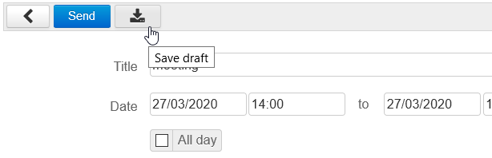
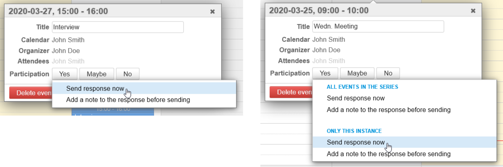
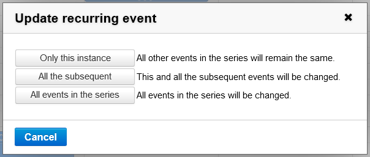
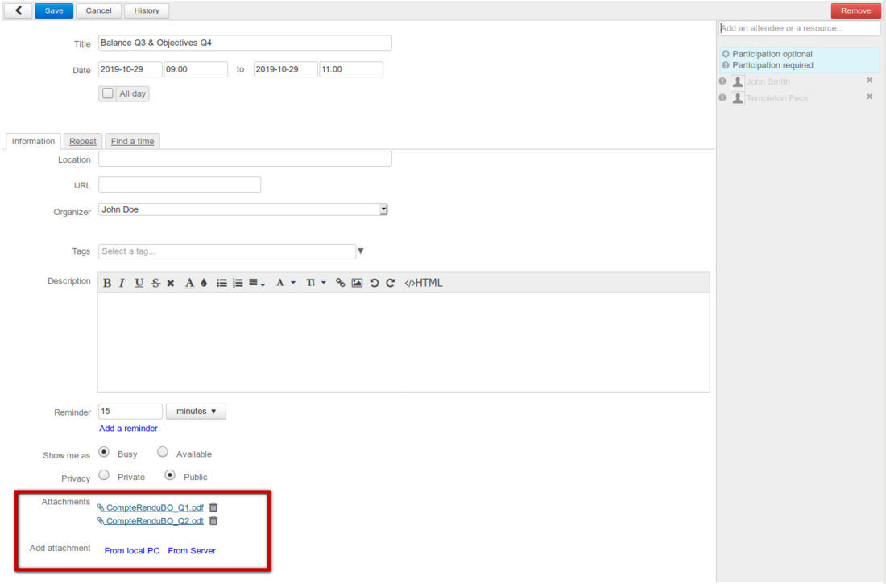
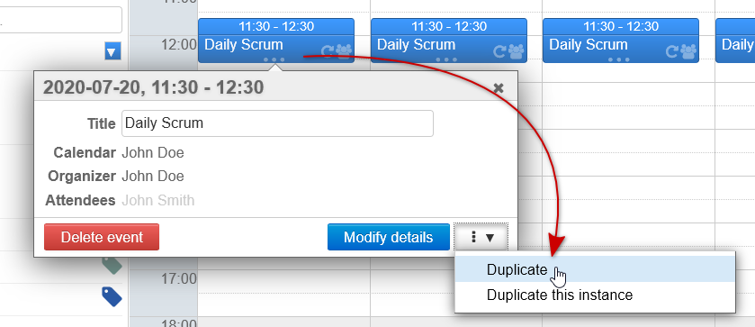
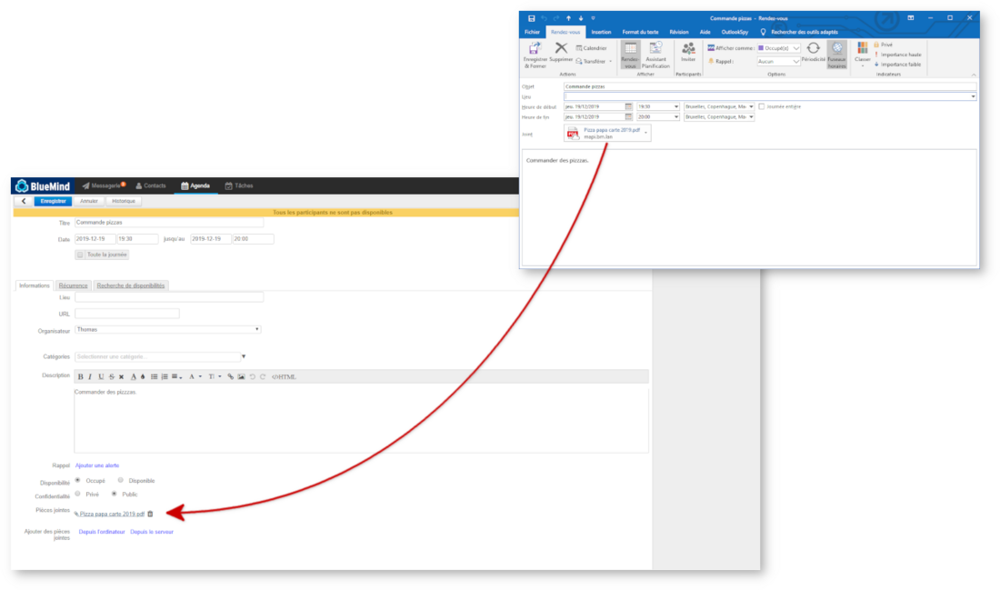
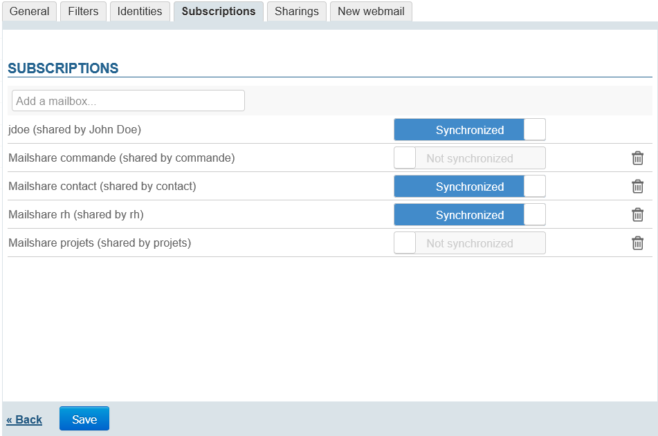
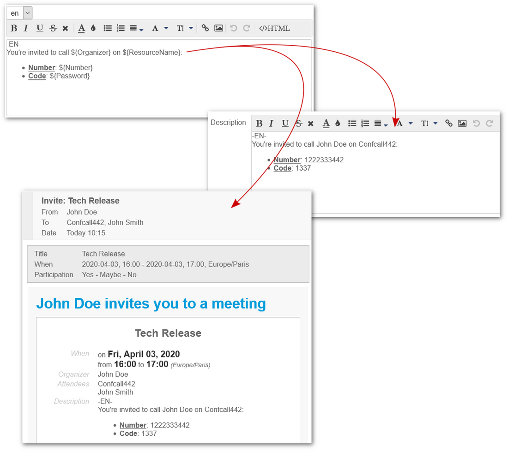
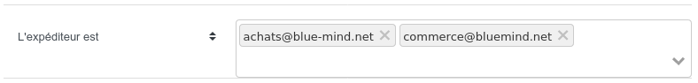

# New in BlueMind 4.0 to 4.3

## Foreword

BlueMind is proud to announce the release of its latest Collaborative open-source email suite. This long-awaited version 4 offers **exclusive, transparent, Outlook-compatible** support to businesses and public administration organizations who can now reconcile **sovereignty and user satisfaction**. 

Only this new version is **capable of fully supporting Outlook MAPI mode with no loss of functionality, while enriching collaboration with other clients such as Thunderbird, web or mobile applications. **

It also brings new features such as enterprise signatures, updated calendar functionalities and significant performance improvements. 

Find out all about it below, as well as about other improvements and new features which is the result of several years' work**. **

- [Foreword](#NouveautesBlueMind4.0a4.3-Foreword)
- [Calendar](#NouveautesBlueMind4.0a4.3-Calendar)

    - [Improvements to invitations and attendee management](#NouveautesBlueMind4.0a4.3-Improvementstoinvitationsandattendeemanagement)
    - [Unified behavior for recurring events](#NouveautesBlueMind4.0a4.3-Unifiedbehaviorforrecurringevents)
    - [Calendar attachments](#NouveautesBlueMind4.0a4.3-Calendarattachments)
    - [Improved performance](#NouveautesBlueMind4.0a4.3-Improvedperformance)
    - [Event reminder improvements](#NouveautesBlueMind4.0a4.3-Eventreminderimprovements)
    - [External calendar synchronization](#NouveautesBlueMind4.0a4.3-Externalcalendarsynchronization)
    - [Event duplication](#NouveautesBlueMind4.0a4.3-Eventduplication)

- [MAPI/Outlook](#NouveautesBlueMind4.0a4.3-MAPI/Outlook)

    - [Inbox sub-folders](#NouveautesBlueMind4.0a4.3-Inboxsub-folders)
    - [Calendar attachments](#NouveautesBlueMind4.0a4.3-Calendarattachments.1)
    - [Attaching emails to other emails](#NouveautesBlueMind4.0a4.3-Attachingemailstootheremails)
    - [Removing message attachments](#NouveautesBlueMind4.0a4.3-Removingmessageattachments)
    - [Technical and performance improvements](#NouveautesBlueMind4.0a4.3-Technicalandperformanceimprovements)

- [Subscription to shared mailboxes](#NouveautesBlueMind4.0a4.3-Subscriptiontosharedmailboxes)
- [Resource contents templates](#NouveautesBlueMind4.0a4.3-Resourcecontentstemplates)
- [Corporate signatures ](#NouveautesBlueMind4.0a4.3-Corporatesignatures)
- [Administration](#NouveautesBlueMind4.0a4.3-Administration)

    - [User password expiry](#NouveautesBlueMind4.0a4.3-Userpasswordexpiry)
    - [Object storage](#NouveautesBlueMind4.0a4.3-Objectstorage)
    - [Data handling](#NouveautesBlueMind4.0a4.3-Datahandling)
    - [Archiving](#NouveautesBlueMind4.0a4.3-Archiving)

- [Development](#NouveautesBlueMind4.0a4.3-Development)

:::info

New in 4.3

 Event duplication 
 Password expiry
 MAPI and EAS shared mailboxes
 Ubuntu 20.04 and RH/CentOS 8 support

:::

:::info

New in 4.2

 Calendar updates: notifications, interface

:::

:::tip

Download BlueMind 4 here: [https://download.bluemind.net/bm-download](https://download.bluemind.net/bm-download)

:::

## Calendar

### Improvements to invitations and attendee management

**In version 4.2**, BlueMind eliminates errors and inconsistencies between users with clearer labels and notification options:

1. **For meeting organizers:** 
    - They now have a "Send", "Save draft" and "Back" (cancel) buttons
    - Saving as draft is only available before invitations are sent. Once guests have been invited, only the "Send" button is left and the organizer is warned that changes will not be sent when they click the "back" button
    - When attendees are added or deleted and no other changes made, the organizer can choose to notify all attendees or not:
    - 
2. **For attendees:** 
    - Attendees can no longer accept or decline an invitation without sending the response. That way the organizer has an up-to-date view of participation
    - Attendees can always send a note with their response
    - As before, they can send a different response for a all instances of one instance of an event only:

### Unified behavior for recurring events

**In version 4.2**, managing recurring events has also been improved. Users can choose what instances of an event to update (only the current instance, the whole series or the subsequent instances in the series) for all the actions performed in calendar view:

 **For more details on these new functionalities, please go to the pages on the [Calendar](/Guide_de_l_utilisateur/L_agenda/), and in particular those on [Events](/Guide_de_l_utilisateur/L_agenda/Les_événements/) and [Organizing Meetings](/Guide_de_l_utilisateur/L_agenda/Organiser_une_réunion/).**

### Calendar attachments

[One of our top user suggestions](https://community.bluemind.net/suggestions/details/SB-809) – being able to **attach files to calendar events** – is finally possible with BlueMind's version 4.1!

Find out more about this feature in our page dedicated to [calendar events](/Guide_de_l_utilisateur/L_agenda/Les_événements/).

### Improved performance

Resource-hungry tasks such as reminders, syncing and backup have been overhauled in version 4.1.4 to improve performance and lighten server load.

### Event reminder improvements

In addition to having overhauled reminder tasks which are particularly demanding on some installations, improvements have also been made to the way event reminders work. Users can customize the type of alert they prefer – an email message or a desktop notification:

Reminders can still be repeated and users can set different reminder types. To find out more, please go to our page on [even](/Guide_de_l_utilisateur/L_agenda/Les_événements/)  [ts](/Guide_de_l_utilisateur/L_agenda/Les_événements/) .

### External calendar synchronization

[External calendars'](/Guide_de_l_utilisateur/L_agenda/Les_calendriers_externes/) synchronization and refresh has been entirely overhauled in 4.1 to:

- Improve performance and make it possible to sync a large number of external calendars
- Enable almost real-time display of external calendars

This overhaul is transparent to users – the interface remains unchanged – but it has significant effects – **calendars are now refreshed on demand, every time they are displayed in the Calendar application**. There is no more need to wait for the auto sync which used to be every hours. Changes made in the third-party app can be seen as soon as the user views the calendar – give or take possible lag due to server load (e.g. a long queue) or server communication (network quality).

Users can still force sync in the Calendar management page.

### Event duplication

Version 4.3 of BlueMind introduces [one of the Suggestion Box](https://community.bluemind.net/suggestions/details/SB-865)'s most eagerly awaited feature: ** **event duplication** **.

You no longer need to retrieve a long list of meeting participants or previously booked resources, just enter the location or the meeting's title, you can now copy the event to create it based on the same template with a simple click!

You can duplicate a single event, an entire series of events or one instance in a series of events.

Find out more about this feature on our page about calendar [events](/Guide_de_l_utilisateur/L_agenda/Les_événements/).

## MAPI/Outlook

Unquestionably BlueMind's most eagerly awaited feature: **comprehensive connector-free Outlook support.**

For more information about implementing MAPI support, go to the dedicated BlueMind documentation page: [Implementing MAPI for Outlook](/Guide_de_l_administrateur/La_souscription_BlueMind/Mise_en_œuvre_de_MAPI_pour_Outlook/)

For more information about supported Outlook versions and known limitations, please refer to our [Compatibility](/FAQ_Foire_aux_questions_/Compatibilité/#Compatibilite-compat-outlook) page.

And check out our [version notes](https://download.bluemind.net/bm-download/4.0-beta/changelog.html) for more detailed information.

### Inbox sub-folders

In earlier versions of BlueMind (4.0.x), folders created under the inbox by Outlook were not mail folders but virtual folders. **BlueMind 4.1 brings inbox sub-folder support**.

:::info

Updates from 4.0.x to 4.1

** **Warning:** ** when updating from BlueMind 4.0.x to 4.1, virtual folders are not migrated and will be deleted.

To prevent this, you can move these virtual folders outside the inbox **before the update** and then return them to the inbox where they will be created again as mail folders.

:::

### Calendar attachments

Just like in the BlueMind calendar (see below), BlueMind 4.1 lets Outlook users attach files to calendar events, which will be visible in BlueMind and from all meeting participants.

### Attaching emails to other emails

A new useful Outlook feature allows users to drag and drop email messages from the inbox into a message compose window. The message is then simply added as an attachment to the new message without having to go through a mail forward or an export/add procedure.

### Removing message attachments

This feature is very useful in reducing the size of mailboxes and organizing mail is now available in 4.1: users can remove email attachments while keeping the message.

### Technical and performance improvements

Great effort has been put into software corrections and general performance improvements as well as the support of some Outlook features. In particular, mail filters and distribution lists have improved significantly.

## Subscription to shared mailboxes

The Exchange Active Sync protocol does not include the notions of shared calendar or mailbox. BlueMind's version 4.3 – thanks to a new subscription feature similar to that used for calendars and mailboxes – lets you show shared mailboxes in MAPI Outlook or EAS mobile devices.

To find out more about this new feature, please go to our user's guide page on [Shared Mailboxes](/Guide_de_l_utilisateur/La_messagerie/Les_boites_aux_lettres_partagées/) and the section on subscriptions in [Mail Preferences](/Guide_de_l_utilisateur/La_messagerie/Préférences_de_messagerie/).

## Resource contents templates

This feature, already available since BlueMind 3.5.13, has been carried over to BlueMind 4.1. Administrators can now set event description templates. When a resource is invited to an event, the template will be inserted into the event's description automatically. These templates can contain variables and be set in different languages to fit the meeting organizer's.

To find out more, please go to our page on  [resources](/Guide_de_l_administrateur/Gestion_des_entités/Ressources/)  in the [Administrator's Guide](/Guide_de_l_administrateur/).

## Corporate signatures 

A new option gives users the possibility to refine [corporate signature](/Guide_de_l_administrateur/Configuration/Signatures_d_entreprise/) settings – in addition to choosing groups, users can now set a signature for one or several selected entities.

## Administration

### User password expiry

Version 4.3.0 introduces user password expiry. When this feature is enabled, users are forced to update their passwords when they expire. Passwords can also be expired with immediate effect by an administrator to force a user to update it.

To find out more about implementing this feature, please go to our page in our Knowledge Base: [Implementing a user password expiry policy](/Base_de_connaissance/Mettre_en_place_une_politique_d_expiration_des_mots_de_passe/).

### Object storage

In version 4.3.0, several enhancements have been made to object storage. System performance and reliability have been improved.

For improved performance, when messages are downloaded in IMAP, the CYRUS-IMAPd server concurrently downloads messages into the object storage system.

To improve IMAP storage reliability, the status tables showing message location are now handled by BlueMind.

### Data handling

To support a greater number of users, BlueMind 4:

- keeps central directory data and user data separate
-   can have several backend servers defined for user data   

To find out more about setting this up, please refer to our dedicated page: [Multi-backend installation](/Guide_d_installation/Installation/Installation_avec_répartition_des_données_sur_plusieurs_serveurs/).

#### Separate directory and user data

BlueMind 4 keeps directory data (users, groups, etc.) separate from user data.

One database is dedicated to directory data. User data is stored in one or several other databases located on storage servers.

After the authentication phase which uses the directory database, users essentially communicate with their storage server.

#### User data storage

With BlueMind 3.5, mailboxes could be distributed over several servers.

BlueMind 4 goes even further providing the ability to distribute calendar, address book etc. data on several servers.

All the data for one user (emails, calendars, contacts, etc.) is now stored on the same data storage server.

#### Automatic storage server management

BlueMind can now handle the full configuration of the storage server (aka *edge server*). The configuration of the nginx server is automatic.

Existing installations aren't automatically handled by BlueMind so as not to interfere with them. For BlueMind to manage a storage server, add the "bm/nginx-edge" tag to the server using the admin console.

When the "bm/nginx-edge" tag is added, the nginx configuration is overwritten by BlueMind's configuration. Any nginx-specific settings will have to be reapplied.

### Archiving

#### Fully automatic archiving

Archiving is now completely automatic. 

This makes archiving transparent for users who no longer have to archive manually and the icon for archived messages or the message archiving/dearchiving button – as in previous versions - are gone.

Users no longer have any tedious tasks to perform to lighten their storage load.

#### Compatible with all email clients

Archiving no longer require a client plugin. It is entirely managed transparently, on the server side.

Archiving works with all email clients (webmail, thick or mobile): whatever the IMAP client, all emails are archived and can be viewed.

To find out more, go to the page: [Archiving](/Guide_de_l_administrateur/Configuration/Archivage/)

## Development

BlueMind 4 adds a new email handling brick to the API REST, which you can find out about in our [API documentation](https://forge.bluemind.net/apidoc/).

For additional support with add-on or script maintenance, this page now shows version incompatibilities: you can therefore quickly see if your development requires a modification or a version upgrade.

