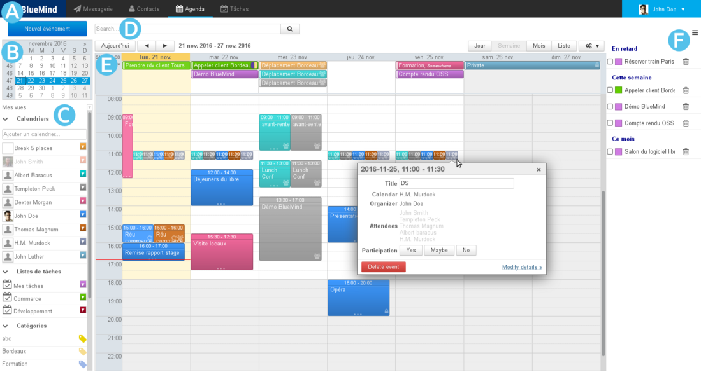
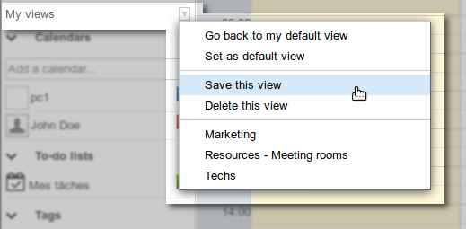
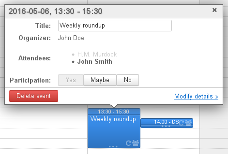
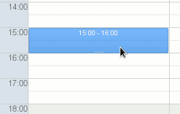
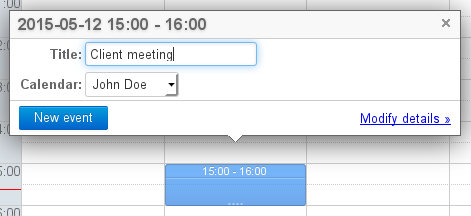
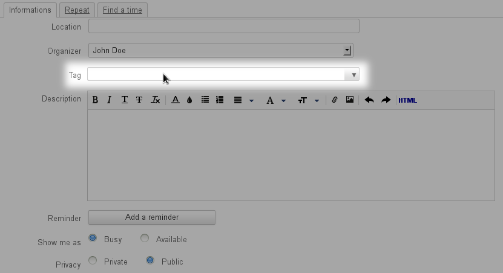

# Getting Started with the Calendar

## Finding your way around the calendar

The BlueMind Calendar's default view is made up of:

- : task bar, used to switch between applications.
- : to search for and go to a specific date: scroll through months using the arrows *and* then click on the date. The main display area then shows the period including the date selected (day, week, or month depending on the current settings).
- : list of calendars currently displayed, as well as access to views and tags.
- : search engine that allows you to look for events by name, tag, details, participant, etc.
- : shows your calendar as well as those you are subscribed to and/or other selected calendars (users, resources)
    - The buttons in the top left corner are used to return to the period that includes the current date and navigate to earlier or later dates.
    - The buttons in the top right corner are used to choose the period or the type of display as well as access to **printing** and **ics import/export**. The tools drop-down menu is also used to refresh the current view.
- : the task panel may be shown or hidden using the    button in the top right corner.

## Calendars

### Selecting calendars

The list of calendars currently displayed is shown to the left of the page, in 

- To **add** a calendar, type its name in the text box and choose the calendar suggested by autocomplete:
- To **hide** a calendar temporarily, click its name in the list: the name becomes grayed out and events are no longer displayed:
- To **remove** a calendar, click the color icon opposite its name, then click "Remove":

### Managing views

BlueMind allows you to save one or several groups of calendars as views. E.g. you can display with a single click all resource calendars, salespeople's calendars, board members calendars or you might want to group a branch's or a team's calendars together. 

Once you've added the calendars you want to the current view, open the menu "My views" and click "Save this view":

- To **create a new view**, type a name for it in the text box.
- To **edit a view,** enter its name or select it from the drop down list.

:::tip

Default view

La vue par défaut définit la vue qui est affichée lorsque l'utilisateur se connecte à l'application. Cette vue ne peut pas être supprimée mais peut être modifiée à tout moment.

Lorsqu'elle n'a pas été personnalisée, celle-ci contient uniquement l'agenda par défaut de l'utilisateur.

:::

*To find out more about calendar views, go to the page * * [Sharing calendars](/Guide_de_l_utilisateur/L_agenda/Le_partage_d_agenda/) and [Calendar > Views](/Guide_de_l_utilisateur/L_agenda/Vues/).

*

## Events

### Viewing events

Events or "appointments" are shown in the color of the calendar it belongs to with its key information:

At the top of the event, its time and title.

At the bottom of the event a series of icons give you a quick overview of its characteristics:

-  multi-participant
-  private
-  recurring
- a square icon shows the color(s) (two at the most) of the event's tags whose complete list is displayed when hovering with the mouse:

Click the event to show more details: organizer (if different from the owner of the calendar viewed), calendar concerned (if different from the user's), participants, participation editing buttons, etc.

This dialog box gives you access to more information as well as the event editing box through the "Detail" link (or "Modify details" link if you have read and write privileges for this calendar).

### Creating events

To create an event:

- ** **Quick create:** **
    - Go to the date and time you want to set up a meeting for and click to create the event.The default duration is 30 minutes, hold the button down and drag to highlight the desired duration.
    - Type a title and select the desired calendar in the dialog box that opens:
    - Click "New event" to confirm and create the event
- ** **Creating a detailed event:** **
    - Click the "New event" button at the top left of the page or click the "Modify details" link from the quick create window.
    - Fill in the desired information, set a recurrence if required, invite participants, etc.**NB: only the title and date are mandatory.**
    - Once all the information is entered and participants have been added, click "Save" at the top of the page to create the event and return to the calendar. 

:::tip

If the event has participants, a dialog box prompts you whether to send invitations or not. If you do want invitations to be sent, all participants – including people outside BlueMind – will be sent an email.

:::

To find out more about creating events and available options, go to the page [Events - §1 Creating appointments](/Guide_de_l_utilisateur/L_agenda/Les_événements/)

For more information about organizing and managing events and participants, go to the page [Organizing a meeting](/Guide_de_l_utilisateur/L_agenda/Organiser_une_réunion/).

## Tags

Tags are used to assign one or several keywords to both events and contacts, as tags are common to both applications.

You can view and edit the list of tags in user preferences > "My account" > "Tags" tab. Shared tags, created by the domain administrator, are shown in bold with a lock at the beginning of the list. These cannot be modified by users.

To assign one or several tags to an event, use the appropriate box in the event's editing page, "Informations" tab:

- Text boxes make autocomplete suggestions as you type.
- If a tag doesn't exist a tooltip appears, allowing you to create one.
- The arrow at the end of the text box opens a drop-down list of existing tags.

Event tags can be seen in the main calendar view, *see above **§ 2.1 Viewing events.** *

*To find out more about working with tags, go to the page [Tags](/Guide_de_l_utilisateur/Les_catégories_tags_/) *

## Printing

To print the current view, open the Tools drop-down menu at the top right of the main display area:

The printing dialog box offers you to print the current view, as a calendar or as a list, printing options allowing you to preview the selection: page orientation, black and white, event details in list view.

*To find out more about printing settings, go to the page * * [Calendar](/Guide_de_l_utilisateur/L_agenda/) * *.*

## ICS exports and imports

- **Exporting **is used to download an ICS file for all or part of your calendar's events.
- **Importing **is used to import events into the calendar you choose  – user calendar or delegated calendar -- from an ICS file.

To access these features, go to the Tools drop-down menu at the top right of the main area:

 *To find out more about ICS imports or exports, go to the page * * [Calendar](/Guide_de_l_utilisateur/L_agenda/) * *.*

