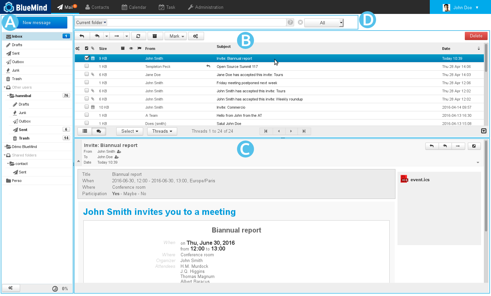
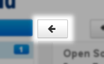
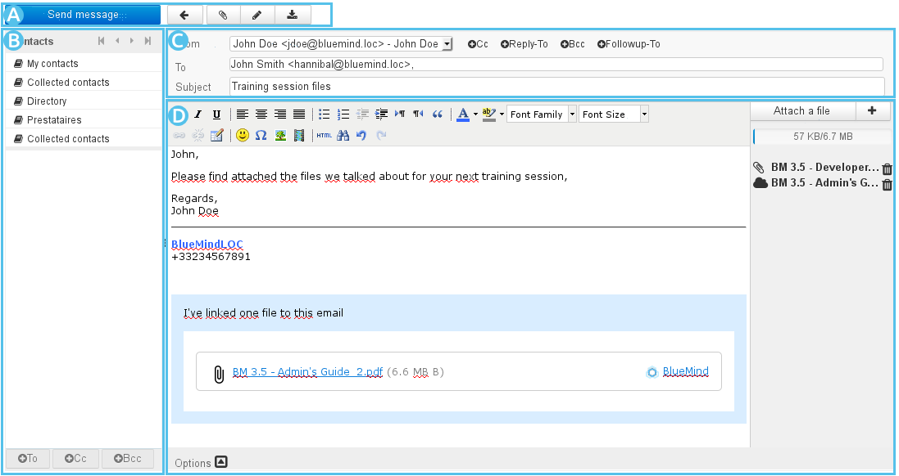

# Getting Started with Mail

# Finding your way around the webmail application

- : the sidebar shows your mail file directory structure, including your own files as well as the [shared mailboxes](/Guide_de_l_administrateur/Gestion_des_entités/Boites_aux_lettres_partagées/) you have access to.See [Mail - §3 Sidebar](/Guide_de_l_utilisateur/La_messagerie/)
- : this area shows the list of messages in the folder selected as well as related action buttons.Unread messages are shown in bold. The columns allow you to sort messages in ascending or descending order. Messages can also be sorted by thread.See [Mail - §4 Message list](/Guide_de_l_utilisateur/La_messagerie/)
- : displays the message selected in the list. You can choose not to show this pane in preferences by selecting two-pane view.Action buttons are used respond to or forward a message. The right hand side shows the list of attachments, which can be downloaded.See [Mail - §5 Message display](/Guide_de_l_utilisateur/La_messagerie/)
- : the full-text, multi-folder advanced [search engine](/Guide_de_l_utilisateur/La_messagerie/Moteur_de_recherche_avancé/) allows you to search messages according to one or several criteria, in all message contents (sender, recipient, subject, etc.) as well as inside attachments.

:::important

The  icon at the bottom right of the message list allows you to switch between 2 and 3-pane mode, the right hand side pane displaying either the list of messages only (2-pane mode) or a selected message under the list of messages (3-pane mode).

:::

# Viewing messages

- 
To **view a message**, click it in the list. It is then shown in** **  in 3-pane view or it replaces the list of messages in  in 2-pane mode.
:::important

To **open a message in full page** even if you're using 3-pane view: double-click the message.

To **go back to 3-pane view**, click the arrow at the top left of the screen:

:::

- 
**Attachments **are listed to the right of the message. Click them to open them with the related application if it is available, otherwise you will be offered to download it.
:::important

To **download all attachments**, click the appropriate button at the end of the list.

:::

- 
The **list of messages is updated regularly**. To force-check for new messages, click the folder to refresh or the   icon "Check for new messages" above the list of messages.

# Accessing other folders

- 
Your own **folders** and your [shared folders](/Guide_de_l_utilisateur/La_messagerie/Les_boites_aux_lettres_partagées/) are listed in the sidebar.

- 
There are 6 default folders: "Inbox", "Drafts", "Sent", "Spam", "Trash" and "Outbox".

- 
You can create **folders and subfolders** in your mailbox.

# Creating and composing new messages

Click  to open the [compose message window](/Guide_de_l_utilisateur/La_messagerie/Le_composeur/):

The message composer makes writing messages easier as you can:

- select sender [identity](/Guide_de_l_utilisateur/La_messagerie/Les_identités/) through an easily accessible drop-down list
- access [address books](/Guide_de_l_utilisateur/Les_contacts/Gestion_des_carnets_d_adresses/) and [contacts](/Guide_de_l_utilisateur/Les_contacts/) through autocomplete in the recipient name box 
- write messages in rich text or plain text
- view attachments and add them by dragging and dropping them from the file explorer
- customize advanced sent messages settings: edition mode (html/text), priority status, request for read receipts, etc.

For further details and help, please go to the page [Composer](/Guide_de_l_utilisateur/La_messagerie/Le_composeur/).

