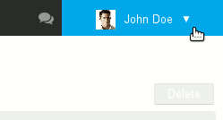

# Getting Started with Contacts

# Finding your way around contacts

- : the first column, under the "New contact" button, shows the list of address books you have access to: your default address books, your personal address books as well as those shared with you and you are subscribed to;
- 
: the second column shows the list of contacts in the address book selected in the first column.
:::important

The vertical alphabet on the left of the area is used to navigate more quickly in contacts. The letters with contacts are highlighted in black and bold.

:::

- : the third column, the main display area, shows the contact card for the user selected in the second column.
- : search box.

# Contacts

For more detailed information about BlueMind's Contacts application, please go to the page [Contacts](/Guide_de_l_utilisateur/Les_contacts/).

## Adding contacts

Click  at the top left of the page, a blank card opens in 

Fill in the desired information and click   at the top left of 

**A contact is created in the address book you are in.**

## Editing contacts

When a contact can be edited, its card is shown as editable when it is displayed. To edit a contact, simply open its contact card.

Fill in the desired information and click  at the top left of 
:::important

To add a type of field that isn't shown by default, use the "Add more fields" button:

:::

## Deleting contacts

Like for editing (see paragraph above), you simply need to view a contact's card to be able to delete it.

Once the card is shown in , click the  button at the top right of the area and confirm deletion.

# Address books

## Default address books

By default, BlueMind offers you 3 address books:

- 
**My contacts**: a personal address book in which you can keep and manage your contacts.

- **Directory**: a public address books that includes all public domain users. This address book cannot be edited and is automatically populated by BlueMind. It includes users, distribution groups and shared mailboxes.
- 
**Collected contacts**: automatically gathers the addresses of message recipients that are not included in the directory.

## Managing address books

You can manage your address books in the user settings section:

### User address books

The first tab allows you to manage your address books:

- The first part of the tab is used to create a new address book, in which you can import contacts from a Vcard file if you choose to.Once the name and – if you choose that option – the file name are filled in, click "Add" to create the address book.
- 
The second part of the tab shows the list of your address books.
:::important

Please note

  - The address books "Contacts" (aka "My Contacts") and "Collected contacts" cannot be deleted.
  - The address book "Directory" is not shown as you are not allowed any action on it: users are not able to share it, import contacts into it, delete it or unsubscribe from it.

:::

### Subscriptions to shared address books

The second tab is used to manage subscriptions to shared address books (domain, users, groups, etc.):

- **To add a subscription: **enter the name of a shared address book and confirm with &lt;Enter>. Autocomplete helps find address books that have been shared with you more easily (the address book's owner or administrator has given you read or read/write privileges).
- 
**To delete a subscription** to an address book, click the   icon at the end of the corresponding row. 
:::important

Please note

Subscriptions to the directory and to personal address books cannot be deleted. All users are automatically and unoptionally subscribed to them.

:::

### Sharing address books

The third tab in the Contacts settings window is used to share your personal address books with other domain users or groups.

1 Select the address book you want to share.Users can share:
  - their personal address books: Contacts (aka "My Contacts"), Collected Contacts and address books they have created.
  - address books they have a delegation on: they were given the right "Can update contacts from this address book and manage sharing"
1 If you want to share the address book with all users in the domain, check the box "Allow public share" and select the type of rights you want to grant users.
1 ** **Recommended choice:** ** If you prefer to grant rights individually to specific users or a group, look for them by typing their name in the box and select the rights you want to grant them.
1 Once all rights are granted as desired, confirm by clicking "Save".

### To find out more

For more details about managing address books and how each area works, see the page [Contacts preferences](/Guide_de_l_utilisateur/Les_contacts/Gestion_des_carnets_d_adresses/).

