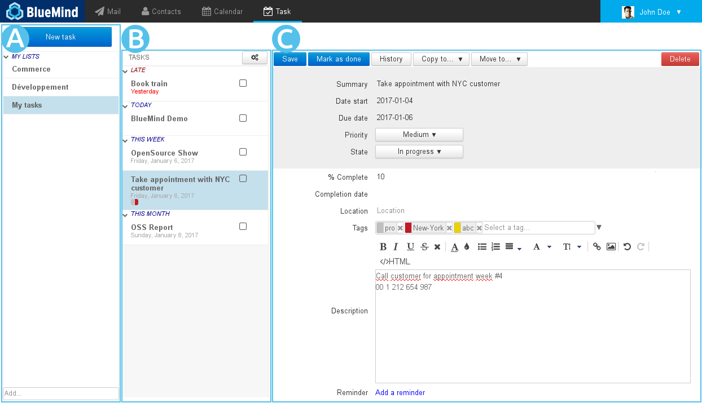
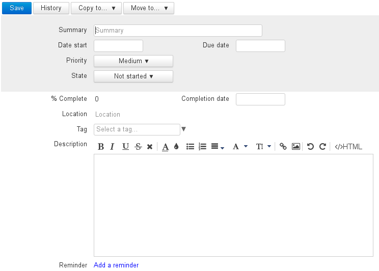
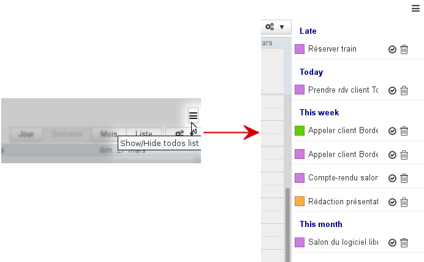

# Getting Started with Tasks

This guide shows you how to take your first steps with BlueMind's new Tasks application.

For more information on how to work with tasks, please go to the page [Tasks](/Guide_de_l_utilisateur/Les_tâches/).

# Finding your way around tasks

The main Tasks view has three columns:

- : the first column, under the "New task" button, shows the tasks lists you are subscribed to: your default "My tasks" list and other lists you may have created or have subscribed to (via your settings).
-   : the second column shows the tasks contained in the list selected. The action button at the top allows you to export and import tasks from and into the list
- : the third column, the main display area, shows the full details of the task selected or being created

## Creating and editing tasks

The  button opens a task creation form and adds the newly created task to the current list.

Clicking a task opens a form displaying the task's details which can be edited:

- **Summary: task name or summary**
- Date start: the date the task is due to start
- Due date: expected end date
- Priority: low, medium (default), high
- State: current progress status – not started, finished, in progress, cancelled
- % Complete: allows you to fill in the task's completion percentage as it progresses
- Completion date: effective end date
- Location
- Tag: tags are shared with the Contacts and Calendar applications. You can use domain tags as well as your own.
- Description: detailed task description, relevant or complementary information
- Reminder: an alert for the task to start

Once you have completed the form, click  to create the task or confirm the changes.

# Ending tasks

BlueMind offers you the following ways of marking a task as completed:

- by clicking the  button in the task editing form
- by using the "State" dropdown list in the task editing form:
- clicking the check box   in the [Calendar's tasks pane ](https://forge.bluemind.net/confluence/display/DA/.Les+taches+vBM-4.0#id-.LestachesvBM-4.0-actions-taches)

# Deleting tasks

To delete a task, you can either:

- click the  button at the top right of the editing form
- click the trash icon  in the [Calendar's task pane](https://forge.bluemind.net/confluence/display/DA/.Les+taches+vBM-4.0#id-.LestachesvBM-4.0-actions-taches)

# Tasks integration in the Calendar

You can find all your tasks in the Calendar. Lists are shown as calendars in the left hand side column. Tasks are shown in the "all-day" area when they are due, and a new column on the right hand side shows an overview of tasks pending completion:

The  button is used to show or hide the tasks pane:

This pane is also where you can perform key task actions: ending or deleting them.

