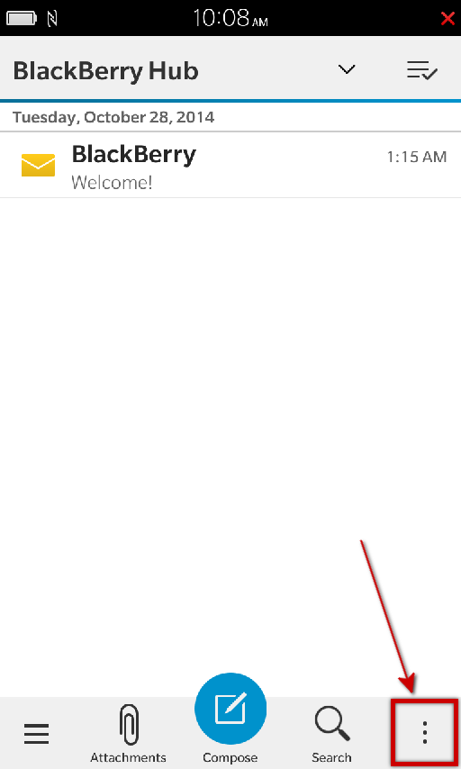
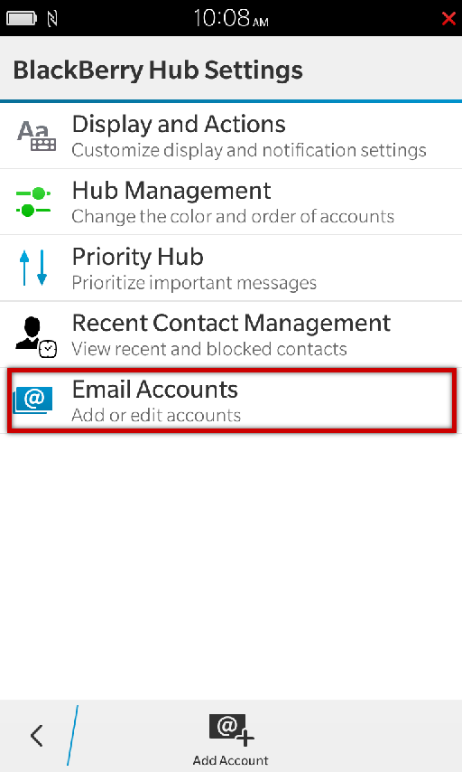
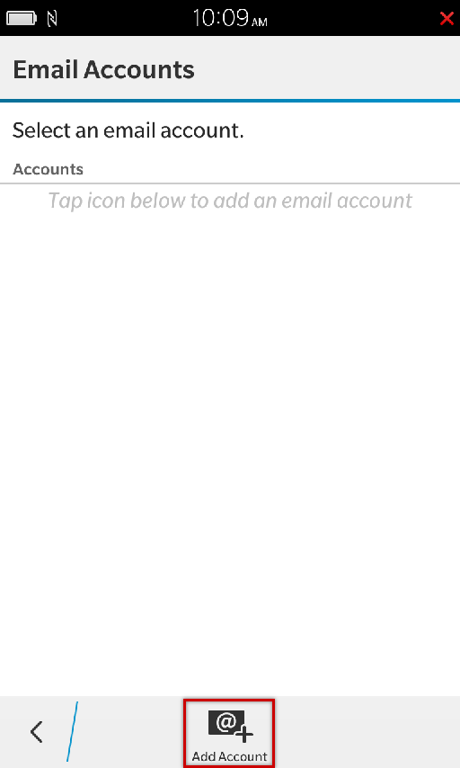
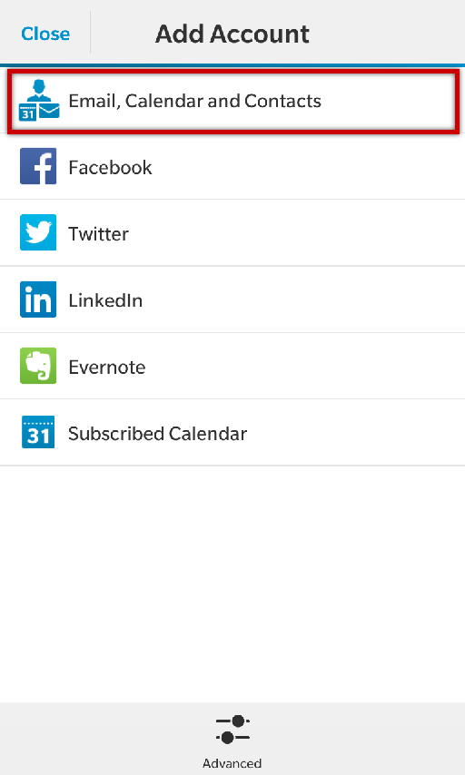
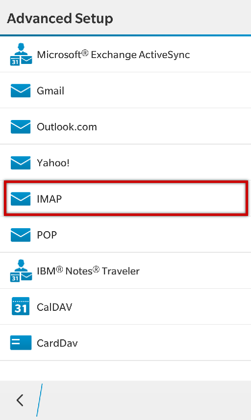
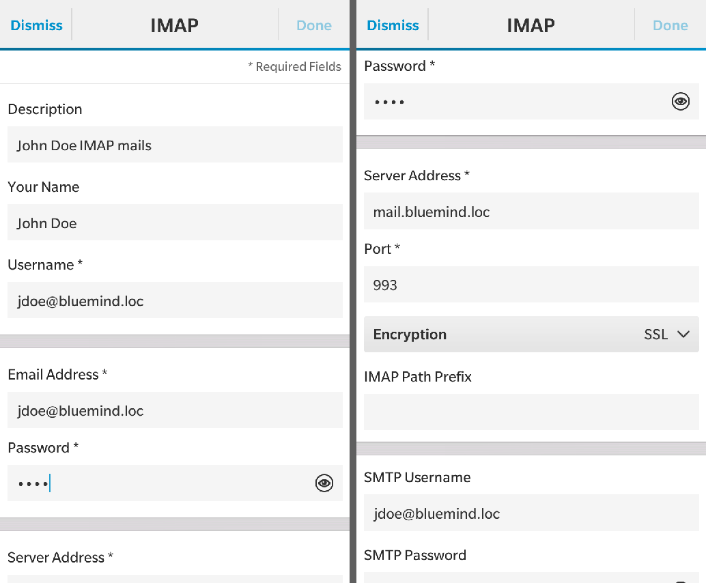
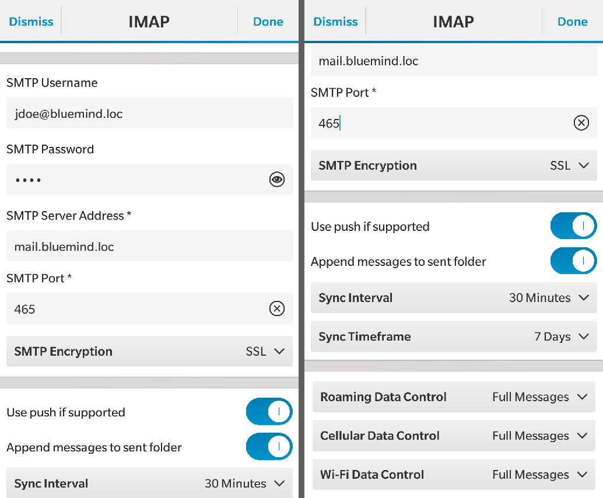
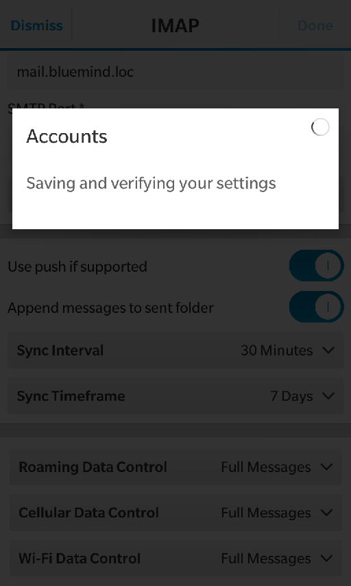
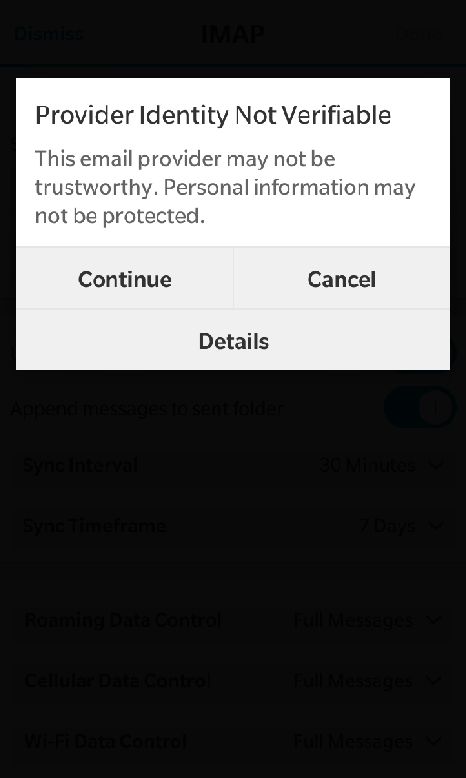
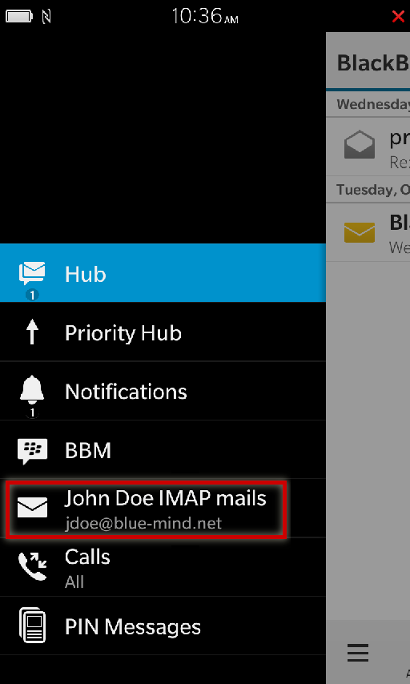

# IMAP Synchronization on Blackberry

Ceci concerne les utilisateurs

:::info

This guide was written using a Blackberry 10 OS. Depending on the version your device is running, operations will be the same although screenshots may vary.

:::

## Setting up an email account

In Blackberry, mail synchronization is handled by Blackberry Hub.
In this application, open the menu:

Go to "Settings":

Go to "Email Accounts":

Select "Add account":

Select "Email, Calendar and Contacts":

Enter the user's email address and tap "Next":

Select IMAP as account type:

The next screen allows you to enter incoming and outgoing server connection settings as well as set up synchronization options. Scroll up to access the fields:

In the first part of the screen:

- "Description" and "Your Name" are free for you to choose. This information will be shown on the device or in outgoing messages.
- "Username", barring special cases, this is the **full email address**, including domain name. 

The next section allows you to configure the incoming server:

- The server address (*mail.bluemind.loc* in this example) is the address you use to access BlueMind (excluding https://).E.g. if you access BlueMind from your browser at **[https://bm.domaine.com](https://bm.domaine.com),** then you should type [bm.domaine.com](http://bm.domaine.com).
- Encryption can be SSL or TLS, depending on the configuration (see *"Ports and security" *box below).

The next section allows you to configure the outgoing server (SMTP), which is used to send messages. Barring special cases, connection information and addresses are the same as for the incoming server, only the port number is different.

The next section allows you to configure the account's key information:

- "Use push if supported": enable the server's *push* notifications for incoming messages.With this option, the device no longer queries the server regularly to check for new messages, the server informs the device when a new message comes in instead.
- "Append messages to send folder": places a copy of the message in the sent messages folder.Warning: this option not only uses storage space on the server and on the device, but also mobile data during copying to the server.
- "Sync interval": time between synchronizations.
- "Sync timeframe": number of days to synchronize for.

The last part allows you to configure how the device behaves depending on the type of network it is connected to:

- "Roaming": when you are connected to a mobile network other than your operator's, e.g. a partner network abroad. This usually entails extra costs compared to your usual connection.
- "Cellular": when you are connected to the mobile network (Edge, 3G, 4G, etc.).
- "Wi-Fi".

For each type of connection, you can choose to retrieve whole messages, message headers only, or restrict retrieval to a certain size.

:::info

Ports and security

The options shown above are those set by default. Ports and connection methods may vary. If you have trouble with this, contact your administrator for the specific information to enter.

IMAP (incoming server):

- 143: TLS possible
- 993: SSL

SMTP (outgoing server):

- 25: TLS possible but not required.
    - no authentication: messages can be sent to one of BlueMind's domains only.
    - with authentication or authentication from an IP listed in the administrator's interface in System management > System Configuration > Mail tab > boxes "My Networks": messages can be sent to any recipient.
- 465: SSL + authentication required - messages can be sent to any recipient.
- 587: TLS + authentication required - messages can be sent to any recipient.

:::

Tap "Done" at the top of the screen once all parameters are entered.

The device checks the server connections and informs you of possible issues with certificates if any. Tap "Continue":

 

The application returns to Hub's homepage showing all messages for all accounts. To view the new account's messages only, open the menu and select the account:

 

 

 

 

