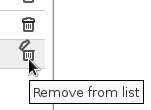

# Managing Shares

All types of shares (mailboxes, user calendar, resource calendar, etc.) are managed via the same form.

## Adding users

To add a user (individual or group):

- Start typing the user's name in the "Add person or group...".As you type, autocomplete will start suggesting a list of users extracted from the directory. Click the user you want to add to the list:
- Select the rights you want to give this user.
- Do this for all the users you want to grant rights to.
- **Once all share rights are set, click "Save" at the bottom of the page to apply changes.**

## Modifying user share rights

- In the list of users with share rights, scroll and select the new right.
- Do this for all the users whose rights you want to change.
- **Once all user rights are set as desired, click "Save" at the bottom of the page to apply changes.**

## Removing users

- In the list of users with share rights, click the trash icon at the end of the row:
- Do this for all the users you want to remove from the list.
- ****Once all users are set as desired, click "Save" at the bottom of the page to apply changes**.**

