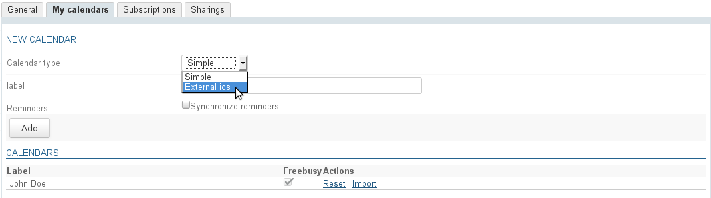
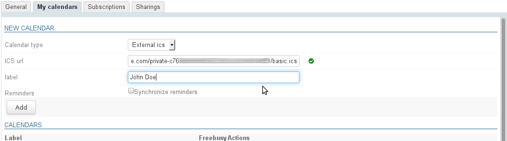
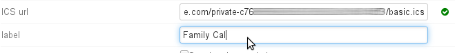
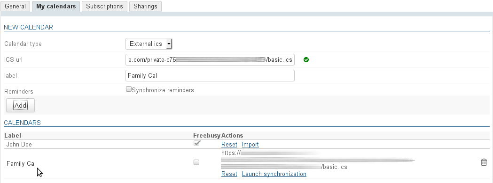
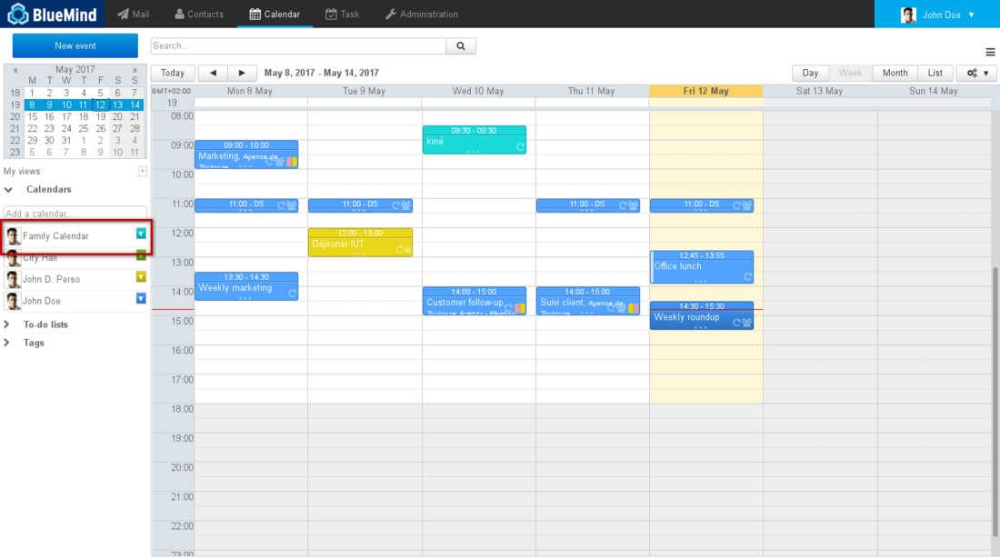
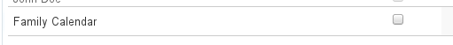
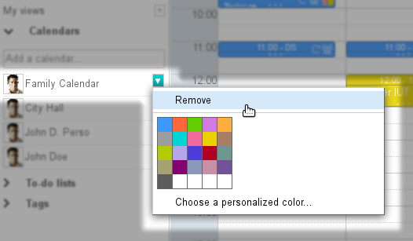

# External Calendars

## Introduction

BlueMind allows you to view external calendars through an iCalendar-type url (.ics extension).

This is synchronization is one way: calendars are only available as read-only, changes cannot be made or saved into the original calendar.

## Prerequisites

- Make sure the url of the calendar you want to synchronize in ics format and that you have the required share settings: the calendar must be accessible externally from your calendar supplier.
- Some providers offer urls with a webcal:// prefix. As BlueMind is unable to handle these, you must edit them replacing "webcal" by "http".

## Adding external calendars

To add an external calendar:

- go to parameter management > Calendar > tab "My calendars"
- in the "new calendar" form, set the calendar type to "external ics": an "ICS url" box is then shown with an icon indicating whether the url entered is valid or not (the icon that original appears is a red "warning" one as the field is empty):
- In the "ICS url" box, copy the address of the external calendar then leave the field to confirm (shift key or click an empty part of the page)
- the engine validates the url and fills in the "label" field if it has correctly accessed the calendar and its name is included:

:::tip

NB: the "label" field can still be edited, allowing you to customize the calendar's name:

:::

- Click "Add" to create the calendar, which is added to your list of personal calendars:
 
The external calendar has two specific links:

    - Reset data: allows you to restart synchronization in case of trouble
    - Launch synchronization: allows you to force synchronization and not wait for automatic synchronization

:::tip

The "Freebusy" column allows you to choose which calendar(s) will be used to show your status when other users query your availability to invite you to an event.

See [Calendar](/old/Guide_de_l_utilisateur/L_agenda/)

:::

The calendar is added automatically to your calendar's default view:

:::info

Refresh rate

**In BlueMind 4.0**, external calendars are refreshed automatically every hour. This rate cannot be changed or configured. If you don't want to wait until the next synchronization, you can click the link "Launch synchronization" when the calendar is created.

**From BlueMind 4.1**, external calendars are refreshed "on demand", i.e. when they are viewed: displaying them in the Calendar app starts a syncing query.
Note: depending on how busy the server and network are, syncing may take a little longer and it might take a few seconds for new events to be displayed.

:::

## Editing external calendars

The only change you can make to an external calendar is its name:

- go parameters > Calendar > "My calendars" tab
- in the list of calendars, click the row of the calendar whose name you want to change to open the edit box:
- chage the calendar's name and tick to confirm (or simply exit the edit box) or cancel with "x".

:::info

Calendar urls cannot be changed, to load a new url you must delete the calendar and then create a new one.

:::

## Removing calendars

### Removing a calendar from view

An external calendar can be removed from default view like other calendars, by clicking its color icon and then "Remove":

### Deleting a calendar

To delete a calendar from your settings:

- go to parameters > Calendar > "My calendars" tab
- click the  icon at the end of the appropriate row

The calendar is deleted immediately and removed from view.

If this fails, [reset local data](/old/Guide_de_l_utilisateur/Paramètres_utilisateur/)   and/or remove the calendar from view (see previous paragraph).

