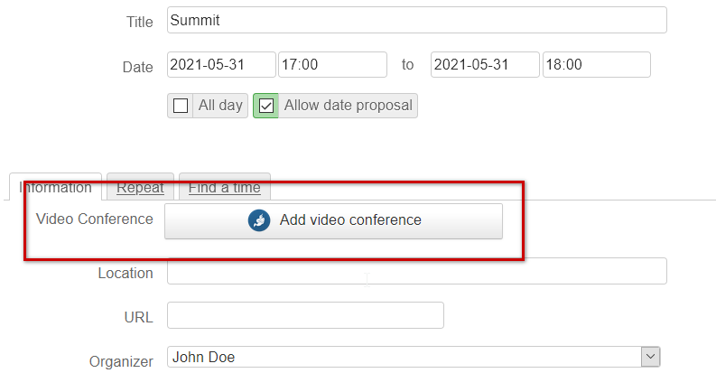
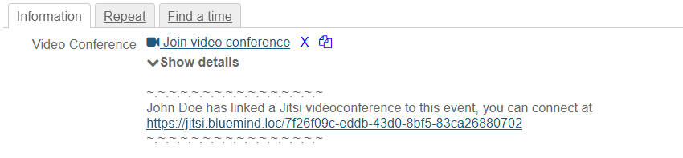
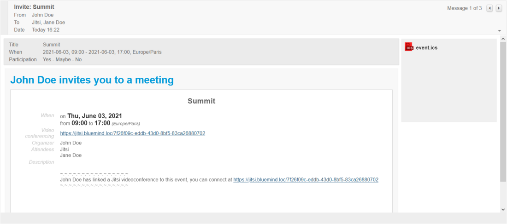
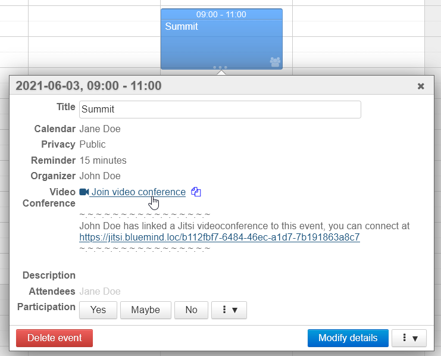
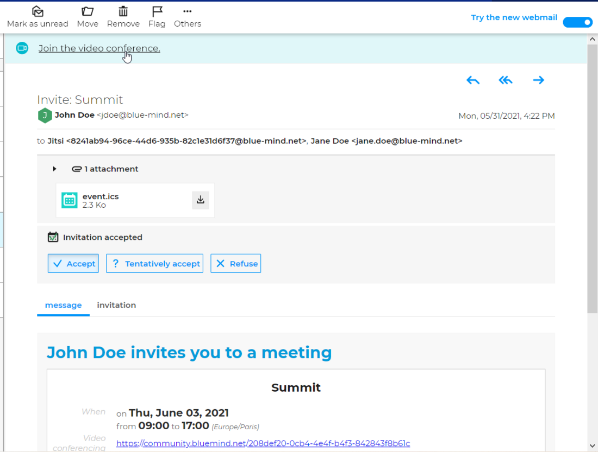
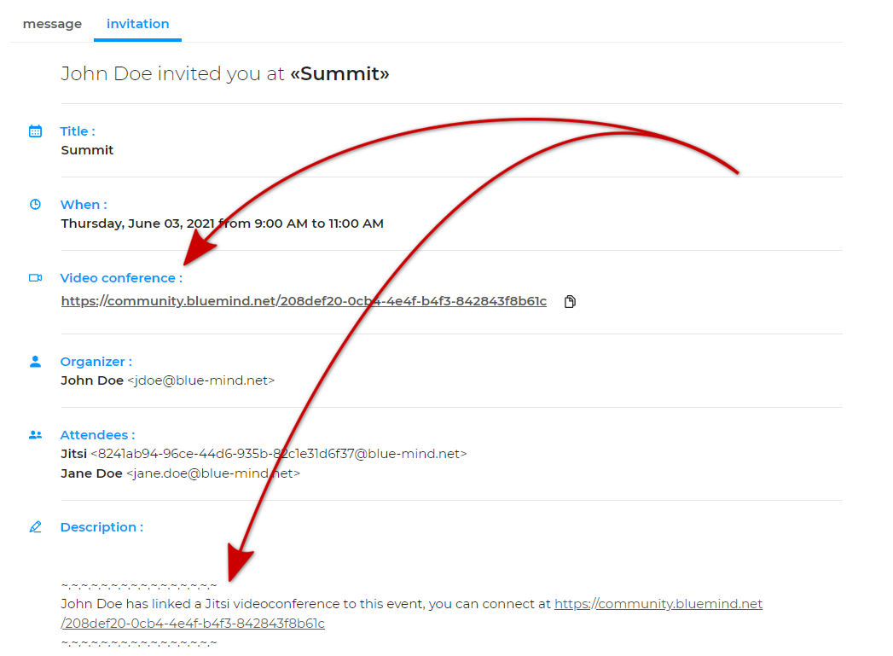

# Linking a Video-Conference to an Event

## Introduction

BlueMind 4.5 lets you link video-conferences to calendar events – links can be added when an event is created, deleted if desired and used by participants to join the meeting.

This feature is currently compatible with the following systems:

- BlueMind Video (Built-in SAAS from BlueMind 4.6.0)
- Jitsi (external service)
- StarLeaf (external service)

**It must be [installed and provisioned by administrators](/Guide_de_l_administrateur/Configuration/Visioconférence_intégrée/) to be available to users.**

## Adding a video-conference to an event

In the event-creation form, Information tab, click the button "Add video-conference":

After a booking-in-progress notification (which may take a few seconds), a link is added to the event, along with a text if one has been set up by administrators:

Two icons are shown next to the event:

-   lets you remove the video-conference from the event
-  lets you copy the address to your computer's clipboard

:::tip

The link is effective as soon as it is generated, even if the event has not been saved. 

:::

## Accessing the video-conference

The link and the description are shown and enabled in the email invitation received by guests:

These items can also be found in the event information popup window, in each participant's calendar (organizer and guests):

:::info

The link can be copied and forwarded, anyone with the link can join the video-conference.

:::

:::tip

New webmail

In BlueMind's new [webmail client](/old/Guide_de_l_utilisateur/Messagerie_BlueMind/), users can join video-conferences by clicking the link in the ribbon at the top of the invitation email:

In addition to the message, as shown above, the video-conference's information can be found in the "Invitation" tab which shows the event's details:

:::

## Removing a link to a video-conference

Organizers can edit their event and delete the video-conference link at any time, by clicking the next to it.

:::info

The link will continue to be valid and lead to a video-conference, but it will no longer be visible in the event information in the organizer's and the participants' calendars.

:::

## Mobile devices

Videoconferencing links can be generated in devices connected as EAS: the link will be generated by the server when the event is saved.

