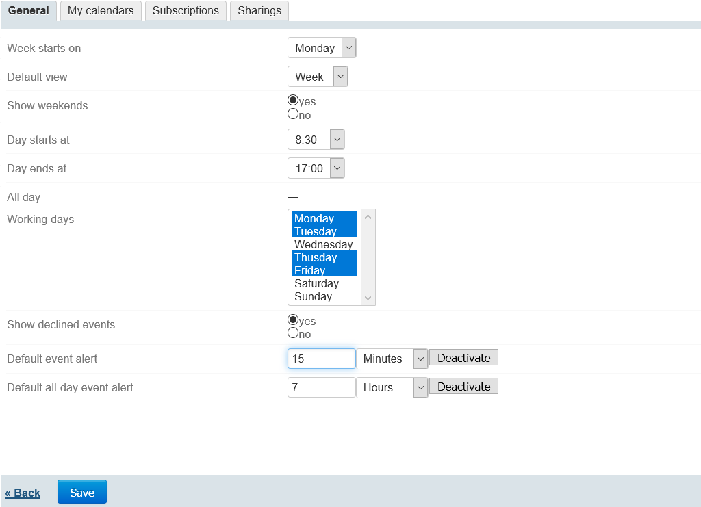
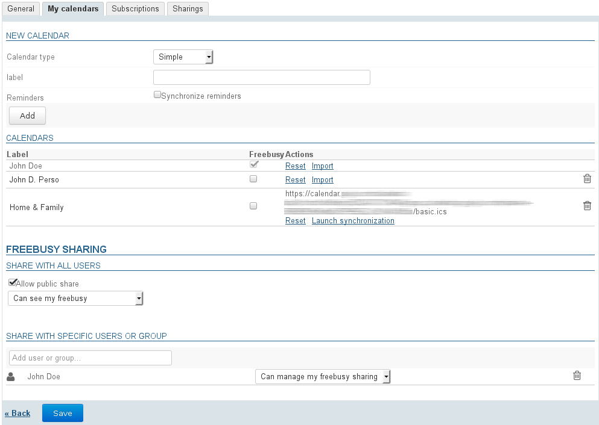
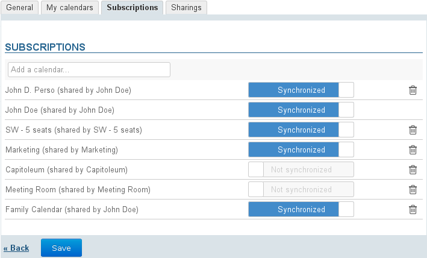
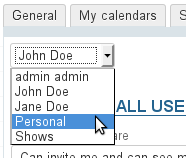
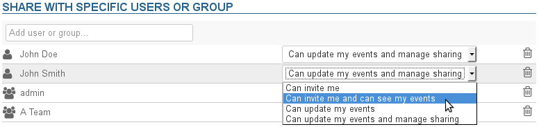

# Calendar Preferences

## Introduction

To access Calendar preferences, go to "My account" in the navigation toolbar and go to "Calendar":

## General preferences

The General tab in Calendar preferences is used to choose display and time settings:

Day start and end times as well as working days settings allow you to specify the hours BlueMind will consider as working. As a result, when someone searches your availability for a meeting for example, they will be alerted if the event is scheduled outside of your working hours.

You can set up or disable default event alerts.
**Please note that this setting isn't retroactive and applies to new events only (existing events will not be modified).**

You can set up both:

- an alert for standard events (with specific start and end times)
- an alert for all-day events (the base time being midnight).E.g. if the default event alert time is set to 7, the alert will be sent at 24-7 = 17.00 hours (5pm)

:::tip

When alerts are disabled, the alert box is empty and the drop-down list is set to "Seconds".

:::

## My calendars

The "My calendars" tab allows you to manage your calendars:

- personal calendars: see [Calendar](/old/Guide_de_l_utilisateur/L_agenda/) - §3 Multiple calendars
- external calendars: see [External Calendars](/old/Guide_de_l_utilisateur/L_agenda/Les_calendriers_externes/)

## Subscriptions

In this tab, you can subscribe to calendars – personal, shared or domain calendars – and enable calendar synchronization for online or third-party client use (thick client software or mobile device).

 When synchronization is enabled for a calendar, the data is downloaded into the thick client. As a result:

|  | Synchronization Enabled | Synchronization Disabled | Web Application and Thunderbird | EAS iOS | EAS (other) | DAV | Outlook |
| --- | --- | --- | --- | --- | --- | --- | --- |
| the calendar can be viewed and is available offline | the calendar can be viewed in online mode but is unavailable offline |
| 
the calendar can be viewed and is available offline

:::info

Shared calendars

In BlueMind version 4, this only applies to the user's calendars (default or secondary calendars). Shared calendars are not shown, whether they are domain calendars or other users' calendars.

:::
 | the calendar cannot be viewed |
| 
**if this feature is enabled by the administrator **(please go to the [Compatibility](/FAQ_Foire_aux_questions_/Compatibilité/) page for more details):
- the calendar can be viewed
- the calendar is available offline

:::info

Shared calendars

In BlueMind version 4, this only applies to the user's calendars (default or secondary calendars). Shared calendars are not shown, whether they are domain calendars or other users' calendars.

:::
 | 
the calendar cannot be viewed
 |
| the calendar can be viewed and is available offline |
| - the calendar can be viewed and is available offline | 

 | - if a calendar subscription is added in Outlook, it is automatically added in BlueMind when synchronization is enabled | the calendar cannot be viewed |

:::info

When a calendar contains a large amount of data (more than 9,000 items), you will receive a message warning about synchronization issues.

:::

To add a calendar:

- Type the name of the calendar you are looking for (user, resource, ...).
- Press &lt;Enter> to confirm or choose from the list of autocomplete suggestions.
- Disable synchronization if desired.
- **Click "Save" to apply changes.**

To delete a calendar:

- Click  at the end of the row.
- **Click "Save" to apply changes.**

:::info

You must click "Save" for the change in synchronization status to be applied then **run synchronization again (or wait for automatic synchronization)** on the client software for changes to be applied (data download and viewing if enabling, data deletion if disabling).

:::

## Managing sharing

The "Sharings" tab allows you to manage the shared calendars you are the manager of: your own calendar as well as those of resources or other users you have been given editing and management rights on.

:::info

By default, your personal sharing rights (modification and management) are shown: these cannot be deleted or reduced.

:::

To manage sharing settings: 

- Select the entity (user or one of its delegates) you want to manage from the drop-down list:
- In the text box, type the name of the person or group you want to share the calendar with.
- Type &lt;Enter> or select a name from the list of autocomplete suggestions to confirm.
- The user is then added to the list. Select the rights you want to grant them from the drop-down list: 
    1. **Can invite me**: the user can invite you by adding you to a list of event participants.
    2. **Can invite me and see my events**: in addition to the right above, the user is able to view your calendar. 
    3. **Can update my events**: in addition to the rights above, the user can add events to your calendar, edit and delete them and accept or reject event invitations in your name.
    4. **Can update my events and manage sharing**: in addition to the rights above, the user can manage your calendar's sharing settings. 
- Once all sharing options are set as desired, **click "Save" to apply changes.**

:::info

The "Public share" area allows you to enable and apply sharing options to all** domain users**. Enable this only if you are absolutely sure you know what you are doing.

:::

For more details, see [Managing Shares](/old/Guide_de_l_utilisateur/Gestion_des_partages/)

