# Calendar

## Introduction

BlueMind incorporates a complete shared calendar with many features such as:

- daily, weekly, monthly and list view 
- multi-calendar, multi-user views
- available time slot search
- full-text search
- rights and delegations management
- Outlook synchronization
- Thunderbird integration
- mobility for smartphones and tablets (iPhone, iPad, Android, Blackberry)
- calendar printing
- recurring events, exceptions, private appointments...

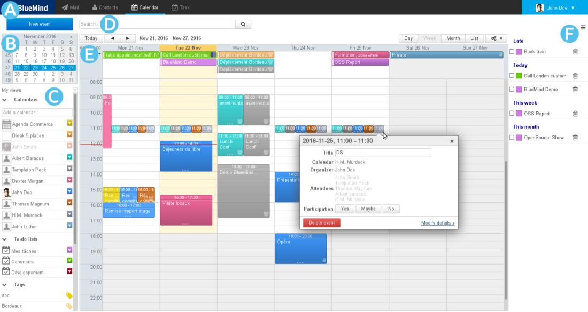

## Display and navigation

### The main view

The primary default view of the BlueMind calendar is made up of:

- : task bar, used to switch between applications.
- : search for and go to a specific date. Scroll through months using the arrows *and* then click on the date. The main display area then shows the period including the date selected (day, week, or month depending on the current settings).
- : list of calendars currently displayed, as well as access to views and tags.
- : search engine to look for events by name, tag, details, participant, etc.
- : shows your calendar as well as those you are subscribed to and/or other selected calendars (users, resources).
    - The buttons in the top left corner are used to return to the period that includes the current date and navigate to earlier or later dates.
    - The buttons in the top right corner are used to choose the period or the type of display as well as access to **printing** and **ics import/export**. The tools drop-down menu can be used to refresh the current view: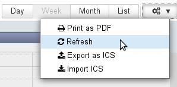

- : the task panel may be shown or hidden using the  button in the top right corner

Events are marked with icons that give you a quick view of their properties:

-  event with multiple attendees
-  private event
-  recurring event

### Selecting calendars

The list of calendars currently displayed is shown to the left of the page, in 

- To **add** a calendar, type its name in the text box and choose the calendar suggested by autocomplete:
- To **hide** a calendar temporarily, click its name in the list: the name becomes grayed out and events are no longer displayed: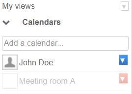
- To **remove** a calendar, click the color icon opposite its name, then click "Remove":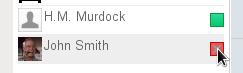

## Working with meetings

**In version 4.2**, the BlueMind model and interface have been improved further. Clearer notification names and options help reduce errors and discrepancies between users. Recurring events have also been improved: being able to choose how changes affect events (the whole event, the whole series or further events in the series) has been rolled out to all actions performed in Calendar view. 

### Custom meeting versions

Each participant has their own version of a meeting. This means they can edit it (location, category, note, etc.) or set a **different attendance status** for an occurrence of a series of meetings: they can accept the whole series but indicate that they will not attend one or several occurrences, for instance.

### Organizing and participating in meetings

:::info

For better meeting management, **organizers must be a participant in the events or meetings they organize**.

To delegate a meeting or an event, i.e. create an event in a third-party's calendar (user, resource or shared calendar), the event's creator must:

1. have **writing rights** ("Can update my events") on that calendar
2. **display it** in their view
3. **set the third-party as the organizer**

:::

E.g. if John Doe wants to create a new meeting in John Smith's calendar:

- the user "Smith" must grant the right "Can edit my events" to the user "Doe"
- Doe displays Smith's calendar 
- Doe creates an event, selecting Smith
    - in the "Calendar" drop-down list – when quick-creating an event: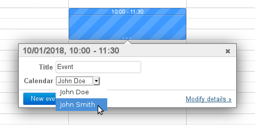 Note: the event color changes immediately and takes the color of J. Smith's events
    - in the "Organizer" drop-down list -- when using the detailed event creation form: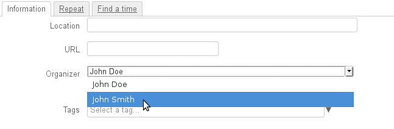

### Invitations and notifications

#### Sending notifications

Event information is sent by email, email notifications are therefore required, either by the organizer to inform participants or by participants to inform the organizer of their response or change in status. 

**From BlueMind 4.2**, the application's interfaces have been made clearer and simpler to avoid confusion or inconsistencies between organizers' and participants' calendars. Organizers now have buttons that enables them to send or save as draft. They can also choose to notify all participants or not when they add or remove an invitee. **Participants are no longer able to accept or reject an invitation without sending their response to the organizer.**

:::tip

Changes and notifications

Changes made to tags or reminders are considered personal and are not notified to other participants. All other changes result in information updates being sent to participants.

:::

To find out more, please refer to the [L'agenda](/old/Guide_de_l_utilisateur/L_agenda/) section.
You might want to look closely at the pages on [Events](/old/Guide_de_l_utilisateur/L_agenda/Les_événements/) et [Organizing Meetings](/old/Guide_de_l_utilisateur/L_agenda/Organiser_une_réunion/).

:::info

Versions earlier than 4.2

**If the organizer chooses not to send invitations **when they create a meeting**, participants **will not be notified by email and **they will not see the event in their calendar. **

Additionally, when users accept or reject an event invitation, notifications are only received by the event's organizer who centralizes the information. 

:::info

If participant choose not to send a notification to the organizer, only their version will be modified – the organizer will not see the participants' status.

:::

:::

#### Viewing Participation Statuses 

As a meeting's information is gathered by organizers only, **a participant can only see other participants' statuses **according to the latest version sent by the organizer** **(through an invitation or modification). To see up-to-date participant statuses, you must view the meeting in the organizer's calendar (provided they have granted you reading rights to their calendar):

The same meeting as viewed by John Smith on the organizer's calendar and on his own.

### About resources

Resources work the same way as users.

As a result, to be able to create an event in a resource's calendar, users must have "Can modify my events" rights and set the resource as the organizer.

User with resource booking rights only must create an event in their own calendar and invite the resource.

Resource booking features also allows, in certain cases, automatic bookings or prevents overbooking. To find out more, go to the page about [resources](/old/Guide_de_l_utilisateur/Les_ressources/).

### Domain calendars

#### Behavior

Domain calendars are considered as entities that provide information such as public holidays, company holidays, sales and marketing events (trade shows, presentations, etc.) or local events (town council meeting, exhibition, school council meeting, etc.), training days, team activities, etc.

 **As a result, domain calendars cannot be set as organizers of a meeting or be invited.** 

#### Good practices

Domain calendars can be used for:

- **information purposes**, i.e. for users to view information. **Domain calendars are a good way showing information.** E.g. for a marketing calendar showing the trade shows the sales team is due to attend, or a town council's calendar showing planned meetings and events.
- **operational purposes**, to create events for users. ** You need to use a [resource](/old/Guide_de_l_utilisateur/Les_ressources/) calendar to do this.** E.g. for an on-call duty calendar: create a weekly event "weekend duty" and invite the user concerned each week. This allows you to centralize information and allows users to accept or reject invitations and show their availability.

## Multiple calendars

BlueMind users can create and use as many personal calendars as they like and manage how they are [shared](/old/Guide_de_l_utilisateur/L_agenda/Préférences_de_l_agenda/) the same way they would their default calendar.

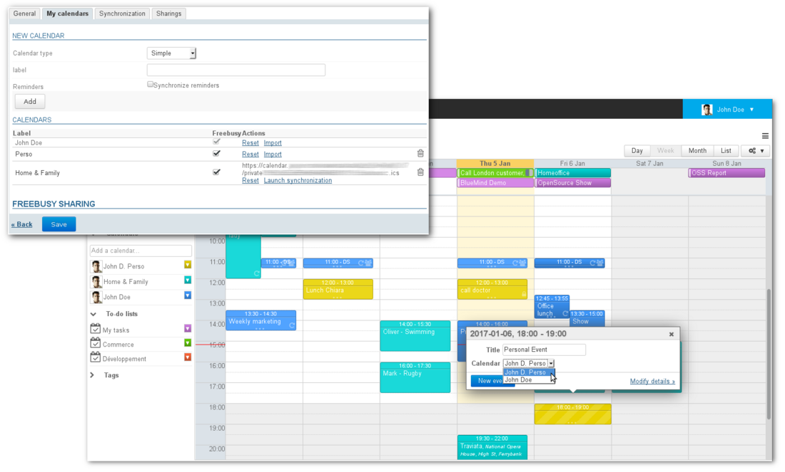

### Creating a new calendar

To create a new calendar:

- go to preferences > Calendar section > "My calendars" tab
- in the "new calendar" section at the top of the tab, select the "Simple" calendar type and name it: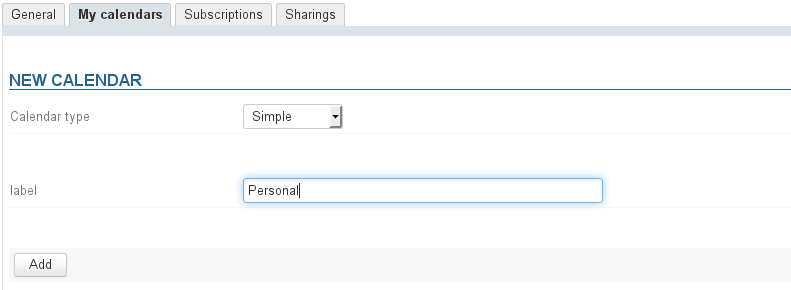
- click "Add" and the calendar is added to your list of calendars: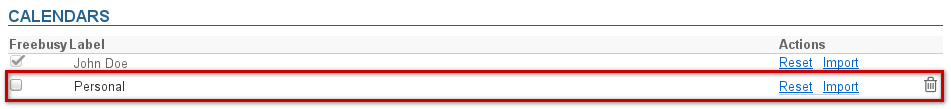

### Editing a calendar

To edit a calendar's name:

- go to preferences > Calendar section > "My calendars" tab
- in the "Calendars" section, click the calendar's name to open the text box and enable the action buttons: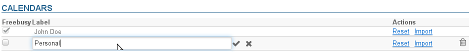
- Enter the new name and 
    - confirm with enter or by clicking the check mark at the end of the text box
    - cancel by clicking the "x" at the end of the text box

### Deleting a calendar

To delete a calendar:

- go to preferences > Calendar section > "My calendars" tab
- in the "Calendars" section, click the trash icon  at the end of the row

:::info

Default user calendars cannot be deleted.

:::

### Sharing availability

In calendar preferences (see above), the "Freebusy" column allows users to select which calendar(s) will be used when other users search their availability to invite them to an event.

:::info

Availability on default user calendars cannot be disabled. To avoid this, that box is grayed out and cannot be un-checked.

:::

Once you've selected the calendar(s), fill in the "freebusy sharing" form:

- either by enabling public share which makes availability visible to all domain users
- or by specifying "share with specific people or group":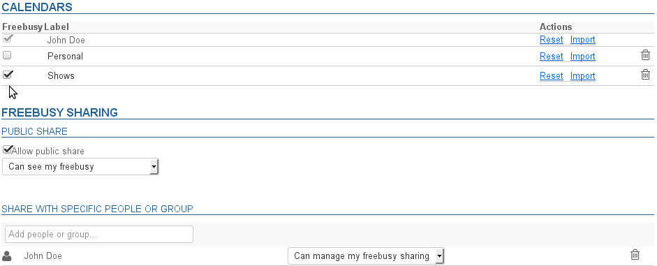

Sharing can be set as:

- Can see my freebusy
- Can manage my freebusy sharing

## Printing

To print the current view, open the Tools menu at the top right of the main display area:

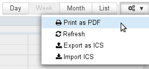

In the print dialog box, you can choose to print the current view as a calendar or as a list, a preview the selection is shown:

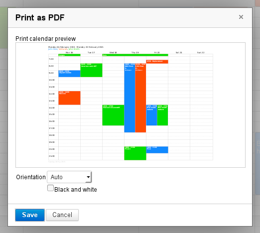

The weekly view shown above produces the following pdf file: [calendarSemaine.pdf](../../../attachments/57770444/72188584.pdf)

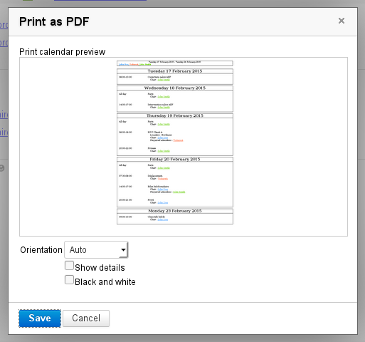

The list view shown above produces the following pdf file: [calendarListe.pdf](../../../attachments/57770444/72188585.pdf)

Click "Save" to download the file.

:::tip

- The drop-down list allows you to force printing as portrait or landscape. By default, automatic mode is selected and adapts to the contents printed.
- The "Black and white" check box allows you to print in gray scale: each calendar will be printed in a different shade of gray in order to improve readability and tell events apart
- In "list" view, an extra check box allows you to print event details.

:::

## ICS Export and Import

ICS exporting and importing is available from the Tools menu at the top right of the main display area:

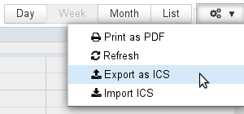

### ICS Export

The dialog box that opens allows you to select the calendar and the events you want to export. By clicking "Export", you are offered to download or open the corresponding ICS file depending on the user's environment configuration:

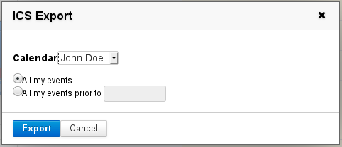

### ICS Import 

The dialog box that opens allows you look for a file on your computer and select the calendar in which you want to import the events. You can choose from all the calendars you have write access to:

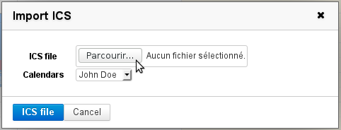

## ICS Synchronization

See [External Calendars](/old/Guide_de_l_utilisateur/L_agenda/Les_calendriers_externes/)

