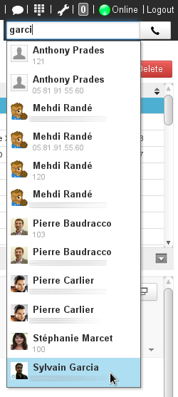
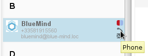
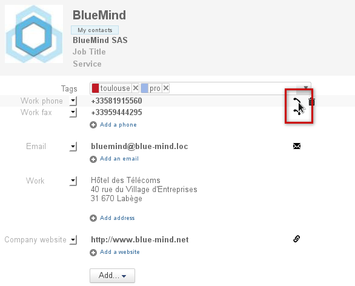
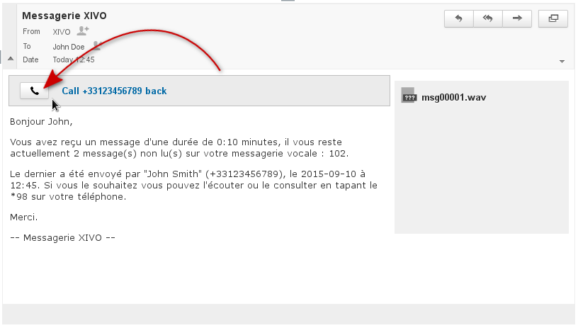
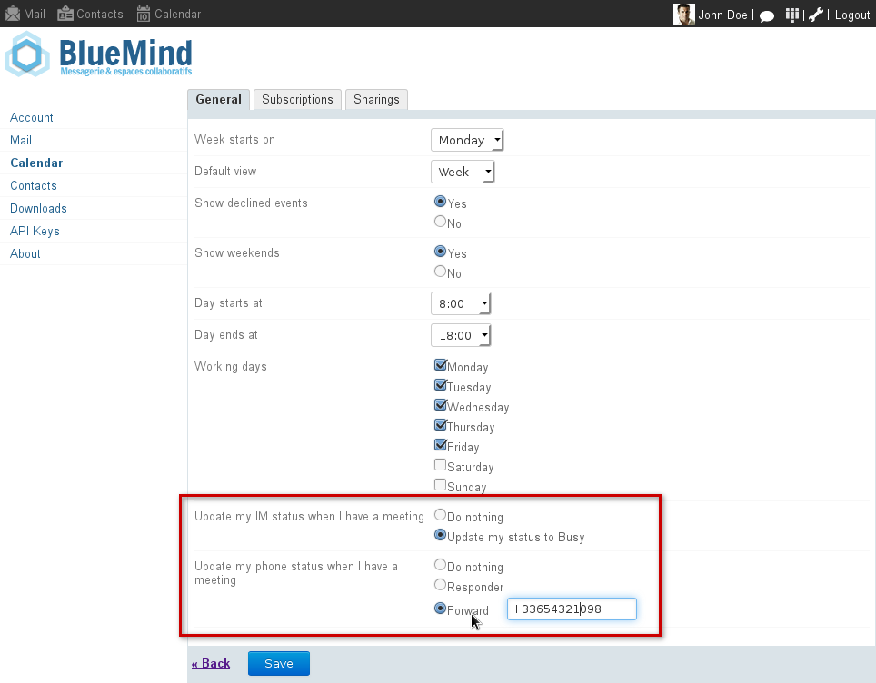
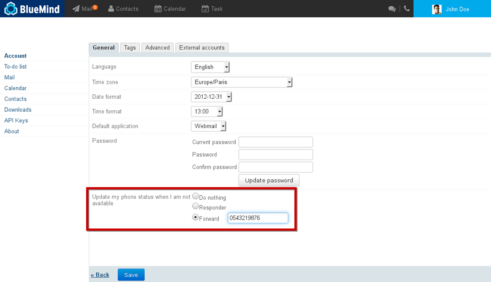

# Telephony

## Introduction

Thanks to its interconnection with [XIVO](https://www.xivo.solutions/) and [Wazo](https://wazo.io), BlueMind becomes a comprehensive unified collaborative messaging service allowing you to:

- receive voice messages in your mailbox
- show your online presence and availability for phone calls
- view the presence and availability of co-workers
- forward calls depending on your presence status
- automatically synchronize your presence status with your calendar appointments
- start phone calls in the web UI
- access a single complete contacts database 

## Making a call

There are three ways to start calls in the BlueMind UI:

- using the dial pad, available in the main menu toolbar
- in the Contacts application
- in a voicemail message

All of these UIs use the "*Click to call" *feature: when you click to make a call, you hear a ringback (ringing) tone and the call starts when the person you are calling answers.

### Using the dial pad

The dial pad is shown in the main menu toolbar, and is therefore available on all the pages of the BlueMind UI. It allows you to start calls by typing a telephone number or, with autocomplete, by searching for a contact.

1. Click the  button in the toolbar to open the dial pad:
2. Type (manually or using cut/paste) the phone number, name or any personal detail of the person you want to call: the search is made on all contact fields (name, job title, email addresses, assistant, etc.).

One person can appear several times: all the numbers for any contact card containing the search terms in any field will be suggested.

3. Click the  button or the number you want or navigate using the up/down arrows on the keyboard and confirm with enter.

:::tip

XIVO searches the following directories:

- User [address books](https://forge.bluemind.net/confluence/display/LATEST/Gestion+des+carnets+d%27adresses): personal address books and the company's directory
- The federated business AD/LDAP directory interconnected with Bluemind

:::

### In the Contacts application

You can start calls directly in BlueMind's Contacts application:

- in the list of contacts, by clicking the icon that appears when you hover over it:
- in the contact card, by clicking the icon at the end of the row of the phone number you want to use:

### In Mail

When someone leaves a message on your voicemail, you get notified with an email message. You can then call them back by clicking  in the message header:

## Presence indicator

In the instant messaging service, phone availability statud is indicated with a colored  (phone) icon before instant messaging availability :

:

Utilisateur hors ligne au téléphone mais disponible pour la messagerie instantanée

Phone availability statuses can be:

 Available

 Online but busy

 Offline/Availability unknown

 (blinking from red to white) Phone ringing

Instant messaging availability can be:

 Available

 Busy

 Away

 Offline

*To find out more about instant messaging availability and managing it, go to the page **[Instant Messaging](/old/Guide_de_l_utilisateur/La_messagerie_instantanée/)**.*

### Synchronizing the presence indicator and call forwarding with the calendar

You can link your presence status to your calendar so that the "busy" status" is shown automatically when you are in a meeting and/or redirect incoming calls to voicemail or a telephone number.

To do this, go to your [Settings](/old/Guide_de_l_utilisateur/Paramètres_utilisateur/) > Calendar section > General tab and:

- enable "Update my status to Busy" for IM
- enable the phone voicemail responder or forward messages:

### Synchronizing call forwarding with IM

BlueMind allows you to set up an automatic forward to your voicemail responder or to a telephone number when your IM status is set to "Busy".

To do this, go to your [Settings](/old/Guide_de_l_utilisateur/Paramètres_utilisateur/) > Account section > General tab and enable the "Forward" option:

Enregistrer

Enregistrer

